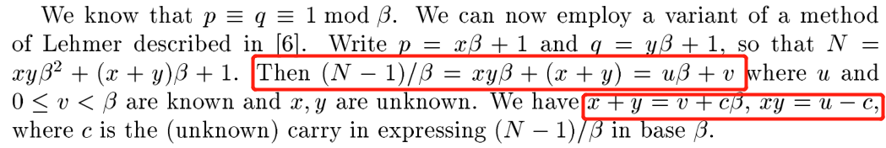
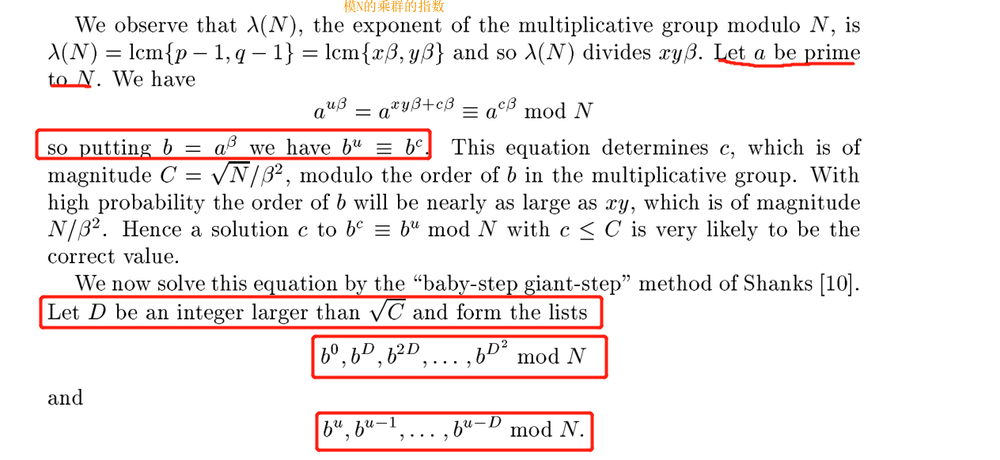
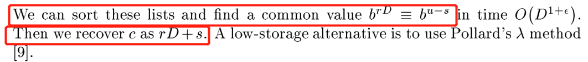

huwangbei2019_Crypto
----
Just decrypt it.

Examination Site
----
* RSA
* multiplicative group modulo N

Analysis
----
The key code:
```python
def gen():
    while True:
        g = getPrime(500)
        a = b = 0
        while not gmpy2.is_prime(2*g*a+1):
            a = random.randint(2**523, 2**524)
        while not gmpy2.is_prime(2*g*b+1):
            b = random.randint(2**523, 2**524)
        h = 2*g*a*b+a+b
        if gmpy2.is_prime(h):
            p = 2*g*a+1
            q = 2*g*b+1
            return p*q, g
```
We will found that p,q have 1025 bit and have a common factor g which has 500 bit.
Howevers,the a,b is unknown and we have to solve them.

Reference:
Further Attacks On Server-Aided Rsa Cryptosystems


According to the article, we can fristly calculate the a\*b and (a+b).

As we have known N and g,we can calculate the u and v:
```python
h = (N-1)/(g)
u = h/(g) # 4 * xy
v = h%(g) # 2 * (x+y)
```
And now we have x + y = v + c\*g and xy = u -c where c is the unknown carry in (N-1)/g in base g.
Since The range of possible values for c is  given cg < 4*(x+y) and x,y <N^(1/2)/g,so that there are of the order of C = sqrt(N)/(g\*g) values of c to test.



The article gives us a algorithm:Find a D being an integer larger than sqrt(C) and form the lists
**b^0,b^D,b^2D,……,b^D\*D mod N** and **b^u,b^u-1,……,b^u-D**
we can sort these lists and find a common value b^rD ≡ b^u-D mod N and the c is rD+s!

Exploit
----

```python
#encoding:utf-8
from Crypto.Util.number import bytes_to_long,long_to_bytes
from gmpy2 import *

# N = pq 2050bit; p 1025 bit; q 1025 bit
N = 67962725468240199924103144864951334845750492508509360358636648068909779932072313362607631417524914992411826230276465100489023746209605790020210412575433464887238013738989770872867041592441153421617243161413094177629581581728221687772551567927241071007480087793370382177952900925657974338348428988433092737432689512506966089398873760401212521089061934975582692308605433023613521500237258699626587149952370997420510392932840377408736864097301789914658244266522930092113493152991783027162871212338968297436073316959569822974289536559300512091342692975133379473145882007983357289924135373382264527866381118893476257705939L
# g 500bit; is p-1 and q-1 prime factor
# p = 2*g*a + 1;p = 2*g*b + 1
g = 3235645591686044532495326878291617484542045511433360748778013933565021819649890342389737893735574764418484922895778834144345295691799766302763199373647L
e = 65537
C = 7918937034819399210460701361082120267249016865135589044938397478179178418982216265766430882604707450651405790878761026681351233717846491757101684210544361607883043938000941498442897699091016071609425252346011280078699567193949155766516051130050592046343488075564740812480634431357869210712013396437065989799117830247228129120071415956115563715118301273810713118159274551107354918579047901176471910532333125717712607469726900731370186233984133546278420585661042017307325998441634272568791745798269084955686428143476025911093137683806174746625559312685862694783475952178855060639359433340135424849663386199035593137765L

h = (N-1)/(g)
u = h/(g)
v = h%(g)

def Solve_c():
    sqrt_N = iroot(mpz(N),2)[0]
    C = div(sqrt_N,pow(g,2))

    a = 2
    b = powmod(a,g,N)

    for i in range(2,C):
        D = (iroot(C,2)[0] + 1) * i
        final = powmod(b,u,N)
        for r in range(D):
            print r*D
            for s in range(D):
                if powmod(b,r*D+s,N) == final:
                    print "r =",r,"s =",s,"i =",i #r = 5168 s = 2145 i = 2
                    return r * D + s

c = Solve_c()
print "c:",c # c = 51589121
A = u - c # x * y = u - c
B = v + c*g # x + y = v + c*g

delta = iroot((B*B-4*A),2)[0]
x = (B+delta)/2
y = (B-delta)/2

a = x/2
b = y/2

p = 2*g*a + 1
q = 2*g*b + 1

d = invert(e,(p-1)*(q-1))
m = powmod(C,d,N)
print long_to_bytes(m)
#flag{bf82d1cd-67b1-42bd-a7b5-f119f0246dfe}
```
