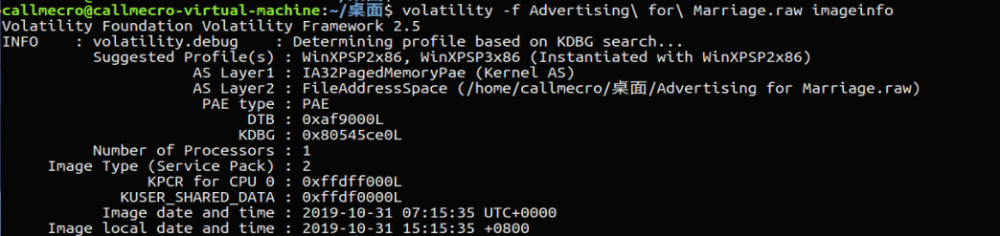
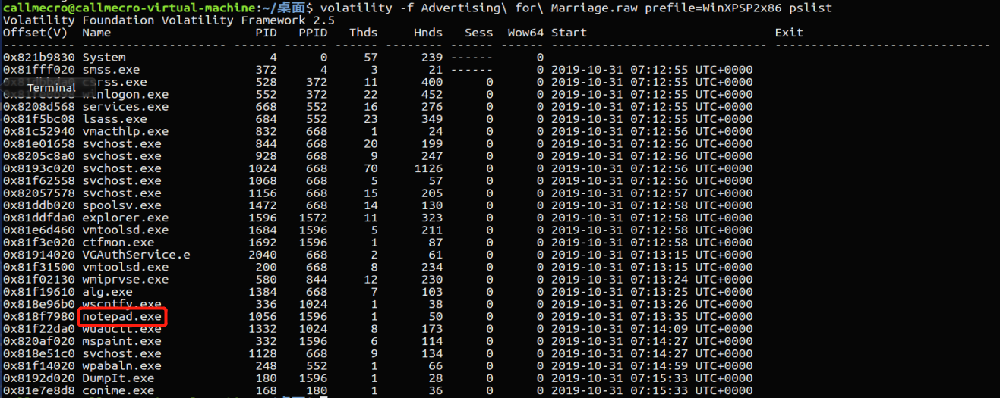
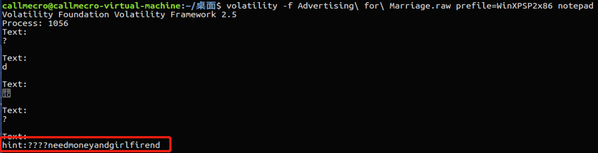
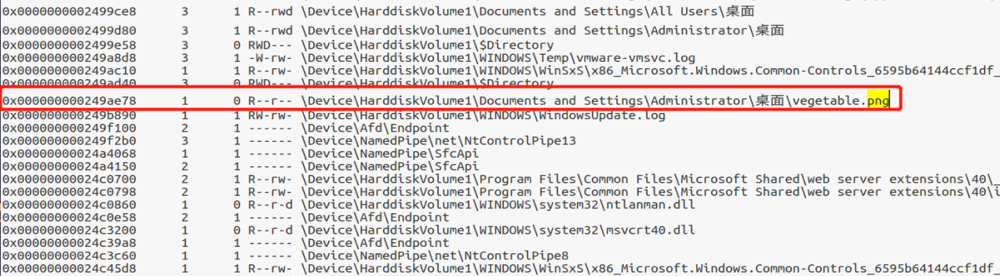
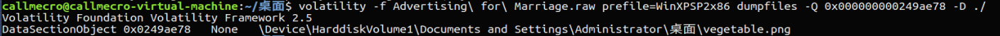
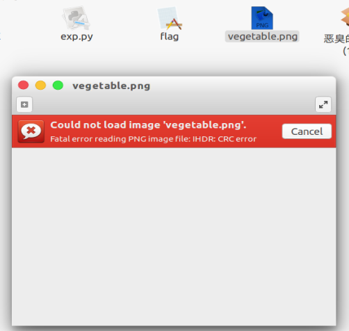
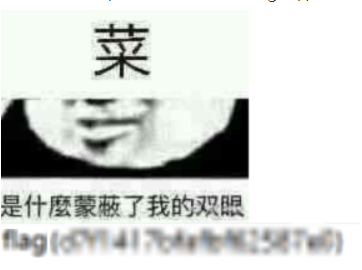
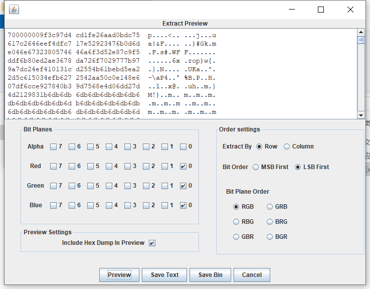
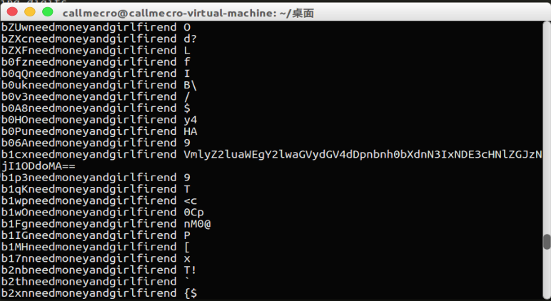

Advertise For Marriage
----
someone want a girlfriend.....

考点
----
* LSB 隐写
* 内存取证
* 图片修复

做题过程
----
首先，先查看镜像信息
```bash
volatility -f Advertising\ for\ Marriage.raw imageinfo
```


选取WinXPSP2x86作为预设
然后查看进程信息
```bash
volatility -f Advertising\ for\ Marriage.raw prefile=WinXPSP2x86 pslist
```

可以看到，存在一个进程notepad.exe，查看一下notepad.exe的内容信息


可以看到，存在一条提示信息:????needmoneyandgirlfirend，应该有什么特殊用途。
接下来，扫描内存中所有文件。
```bash
volatility -f Advertising\ for\ Marriage.raw prefile=WinXPSP2x86 filescan
```

将扫描结果导出到文本文件中，搜索发现存在一张png图片。
将png图片导出。
```bash
volatility -f Advertising\ for\ Marriage.raw prefile=WinXPSP2x86 dumpfiles -Q 0x000000000249ae78 -D ./
```

尝试打开文件，报错: IHDR:CRC



报错位置是IHDR区域，猜测可能是图片尺寸被修改导致。
用python脚本计算图片实际长度和宽度，并生成修复后的图片
```python
import os 
import binascii
import struct 
img = open("vegetable.png", "rb").read() 
for w in range(1024):
    for h in range(1024): 
        data = img[0xc:0x10] + struct.pack('>i',w) + struct.pack('>i',h) + img[0x18:0x1d] 
        crc32 = binascii.crc32(data) & 0xffffffff 
        if crc32 == struct.unpack('>i',img[0x1d:0x21])[0] & 0xffffffff: 
            print w, h 
            print hex(w), hex(h) 
            open("vegetable_new.png", "wb").write(img[:0xc] + data + img[0x1d:]) 
            exit()
```
成功修复图片，得到一张模糊有flag字样的图片



emmmm...然后就有很多人在疯狂地猜测flag，然而最终也没猜出来。
实际上这是一个LSB隐写的图片。
利用StegSolve查看文件的低位，发现猫腻



这里似乎隐藏着什么数据，而700000009似乎是这些数据的长度。
回想起刚刚hint，猜测应该是LSB隐写的密钥，需要进行爆破。
搜索资料，发现这是用 livz/cloacked-pixel 进行加密的。
接下来，我们就魔改一波工具。
```python
def filter(source_str):
	for i in range(len(source_str)):
		if ord(source_str[i]) > 126 or ord(source_str[i]) < 32:
			return False

	return True

# Extract data embedded into LSB of the input file
def extract(in_file, out_file, password):
	# Process source image
	img = Image.open(in_file)
	(width, height) = img.size
	conv = img.convert("RGBA").getdata()
	print "[+] Image size: %dx%d pixels." % (width, height)

	# Extract LSBs
	v = []
	for h in range(height):
		for w in range(width):
			(r, g, b, a) = conv.getpixel((w, h))
			v.append(r & 1)
			v.append(g & 1)
			v.append(b & 1)
			
	data_out = assemble(v)

	# Decrypt
	characters = string.ascii_letters + string.digits

	for i in characters:
		for j in characters:
			for k in characters:
				for l in characters:
					password = i + j + k + l + "needmoneyandgirlfirend"
					cipher = AESCipher(password)
					data_dec = cipher.decrypt(data_out)
					if len(data_dec) > 0 and filter(data_dec):
						print password,data_dec


	# Write decrypted data
```


最后得到密钥：b1cxneedmoneyandgirlfirend
解码base64得到：
Virginia ciphertext:gnxtmwg7r1417psedbs62587h0
根据提示，解密维吉尼亚密码，密钥仍然是刚刚那串字符，得到结果：
flagisd7f1417bfafbf62587e0

flag{d7f1417bfafbf62587e0}
