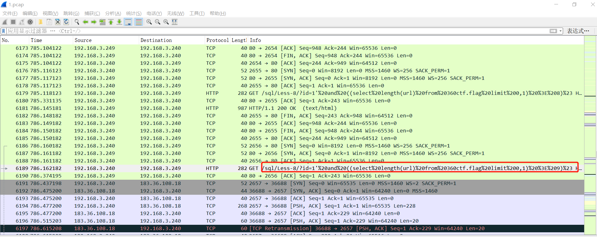

## 360CTF 流量分析题WriteUp
**第一步、分析流量**

   我们用WireShark打开流量包，结合题目描述，发现是攻击者进行SQL布尔盲注的一系列流量。

   我们提取其HTTP的数据包，可以清晰地看到攻击者盲注过程，其中，我们可以看到ctf.flag库中存在两个字段，分别是url与passwd。

   然后通过攻击者盲注的流量，再根据回显的结果，可以得到URL字段的值为：
**<u>t.cn/Ai8PhqSb</u>**
    passwd字段值为：
**<u>bkis</u>**
    我们访问这个网页，然后是一个下载链接，输入密码后即可下载到 **flag.zip**
我们打开这个文件会看到文件里面有flag.txt和Readme.txt，但是有密码，应该不是让我们爆破。正常来说只需要flag.txt即可，Readme.txt显得有些多余，于是想到zip明文攻击。
    重新回到攻击流量中，发现攻击者在注入之后还有多余的操作，主要是读取文件夹和读取文件的操作，其中有一步读取了Readme.7z的内容，我们将返回的字节流导出到Readme.7z文件中。

    接着可以看到里面有一个Readme.txt，于是就可以对其利用zip明文攻击，得到密码**CtF36o!s0**

    用改密码解开flag.zip即可得到flag
    `flag{1d0ea6a36f6aaf7fa5d4b007454227d6}`
    